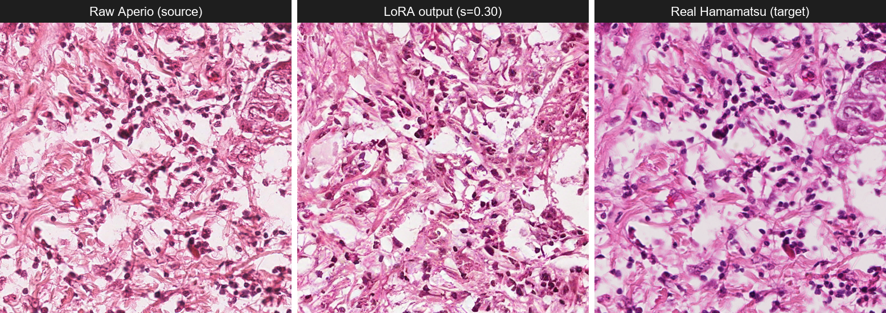
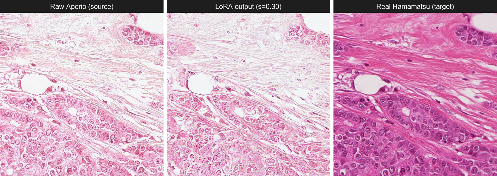

# Few-Shot Scanner Stain Normalisation

Diffusion-based, few-shot H&E **stain normalisation across scanners** (Aperio ↔
Hamamatsu) — a frozen Stable Diffusion 1.5 base adapted with a colour LoRA,
ControlNet, and LCM-LoRA, evaluated for colour fidelity, structural safety, and
clinical utility across multiple public histopathology datasets.

BSc Honours research project, University of the Witwatersrand. Supervisor: Richard
Klein.

## Status

See [`tickets/`](tickets/) for the live task board — one file per phase, each ticket
citing the proposal section it comes from and its current status with evidence
(Slurm job IDs, output files). `tickets/README.md` explains the ticket ID scheme and
status legend. This is the authoritative source for "what's actually done" — treat
anything below as the stable method description, not a progress report.

## Phase model

| Phase | Name | What it does |
|---|---|---|
| **Phase 1** | SD1.5 ablation ladder | Ablation rungs A0–A5 (colour-LoRA + ControlNet + LCM). Training and inference. |
| **Phase 2** | Evaluation | Colour, structural, clinical, cycle-consistency, and multi-centre generalisation. |
| **Phase 3** | SDXL portability | Transfers the best Phase-1 configuration to SDXL. |
| **Probe** | SD3.5 feasibility | Auxiliary feasibility check. **Not a phase** — kept separate and out of the main results. |

## Method summary

A frozen SD1.5 base is adapted with a **colour LoRA** trained on ≤50
coordinate-corresponding crop pairs from a single Aperio/Hamamatsu slide pair
(few-shot), then evaluated for generalisation on five entirely held-out slide pairs
never seen during training. ControlNet (Canny) and an LCM-LoRA are added in later
ablation rungs for structural conditioning and few-step inference. Direction is
explicit: `A2H` (Aperio→Hamamatsu) and `H2A` (Hamamatsu→Aperio, for cycle-consistency
checks) are trained as separate adapters, each at rank 4 and rank 8.

Evaluation is multi-axis: LAB-histogram Wasserstein distance against real paired
ground truth (the strongest test available, since MITOS-ATYPIA-14 provides physical
scans of the same tissue on both scanners), inter-centre variance reduction on
CAMELYON17, HoVer-Net structural-safety checks against Lizard, and downstream
classifier deltas for clinical utility.

## Example outputs

From the first full held-out evaluation of the A2H rank-8 colour LoRA (`P2-04`,
strength 0.30, `eval/a2h_r8/`) — the best- and worst-scoring crops by LAB-histogram
Wasserstein distance to the real paired Hamamatsu ground truth, out of 496 scored
crops across all 5 held-out slides.

**Best case** (A08, LAB Wasserstein 17.54 — closest match to ground truth):



**Worst case** (A06, LAB Wasserstein 91.12 — A06 is a confirmed colour-gap outlier,
see `tickets/PHASE2-TICKETS.md`; the LoRA output visibly shifts less far toward the
target than in the best case, exactly matching the quantitative recovery gap):



Reported here as an honest before/after, not a cherry-picked highlight — the worst
case is A06 because it genuinely is the hardest slide, not despite that.

## Why data is stored by dataset, not by phase

Every dataset here is consumed by **more than one phase**, or is deliberately scoped
to one phase but shares a lineage with data used elsewhere. MITOS-ATYPIA-14 alone
feeds all three phases: Phase 1 trains on the A03/H03 pairs, Phase 2 evaluates on the
held-out slides, and Phase 3 re-runs the same protocol under SDXL.

If the tree were organised by phase, those bytes would have to be duplicated or
symlinked. Instead:

- **`data/` is the single canonical copy of each raw dataset**, keyed by dataset name.
  Nothing under `data/` is phase-specific.
- **Each phase folder carries an `INPUTS.md`** that gives the phase-centric view:
  which datasets and paths that phase reads, and what it writes.

So `data/` answers *"where does this dataset live?"* and `phase*/INPUTS.md` answers
*"what does this phase need?"*.

## Dataset → phase map

| Dataset | Path | Phase 1 | Phase 2 | Phase 3 | Role |
|---|---|:--:|:--:|:--:|---|
| **MITOS-ATYPIA-14** | `data/mitos/` | ✅ | ✅ | ✅ | P1: A03/H03 training pairs + A5 pool. P2: held-out A06/A08/A09/A13/A16. P3: same protocol under SDXL. |
| **CAMELYON17** | `data/camelyon17/` | — | ✅ | — | 5-centre generalisation only. |
| **TCGA-BRCA** | `data/tcga_brca/` | ✅ | ✅ | — | P1: 15 slides, A5 warm-start (`phase0/`). P2: 10 disjoint slides, LAB colour reference (`phase2/`). |
| **PanNuke** | `data/pannuke/` | ✅ | — | — | A5 warm-start, 1,000 patches. **Excluded from geometry evaluation.** |
| **Lizard** | `data/lizard/` | — | ✅ | — | DigestPath / GlaS, HoVer-Net structural safety. |

The TCGA-BRCA Phase-1 and Phase-2 slide sets are **disjoint** — no slide used for
warm-start appears in the LAB colour reference.

All datasets are public research releases (MITOS-ATYPIA-14, CAMELYON17, TCGA-BRCA via
GDC, PanNuke, Lizard) — no patient-identifiable information is used. Raw data itself
is not committed to this repo (see `.gitignore`); it lives locally and on the compute
cluster's `/datasets` storage.

## Code layout

**See [`CLAUDE.md`](CLAUDE.md)'s "Layout" section — it is the canonical reference for
where code lives** (`src/data/`, `src/train/`, `src/eval/`, `slurm/`). This README
does not restate it, to avoid the two docs drifting out of sync.

`phase1_ablation/`, `phase2_evaluation/`, `phase3_sdxl/`, and `probe_sd35/` are
**documentation-only** — each is just an `INPUTS.md` giving the phase-centric view
described above (which datasets/paths that phase reads and writes). They hold no
code, configs, checkpoints, or results; real artifacts live under `src/`, `slurm/`,
and the compute cluster's `/datasets/.../stain-norm/` paths referenced from each
`INPUTS.md`.

### Notes on specific data paths

- **`pairs/`** is a derived artifact and conceptually belongs under `derived/`, but it
  is left at the root because existing manifests and scripts reference it by that path.
  Treat it as `derived/pairs/`.
- **`pairs/baseline_metrics/`** holds the pre-normalisation baseline — the reference
  point Phase 2 scores every rung against (see `phase2_evaluation/INPUTS.md`).
- **`data/camelyon17/raw/*.zip` stay compressed.** Extracting all 15 patients is
  ~100 GB of WSI and is a cluster job, not a local step.
- **`src/eval/progress.py`** is a utility and would fit `src/utils/`, but `metrics.py`,
  `registration.py`, `infer_colour_lora.py`, and `score_outputs.py` import it as a flat
  sibling. It stays in `src/eval/` until those imports are refactored.

## Running this

All training and inference runs on a Slurm HPC cluster, never locally — see
`CLAUDE.md` for the full cluster workflow (partitions, environment activation, known
gotchas). In brief:

```
rsync -av ./src ./slurm <cluster>:<remote-code-root>/
ssh <cluster> 'sbatch slurm/train_colour_lora.slurm A2H 8'
ssh <cluster> 'sbatch slurm/infer_colour_lora.slurm a2h_r8 "0.3 0.4 0.5" 0'
ssh <cluster> 'sbatch slurm/score_outputs.slurm a2h_r8'
```

Each `.slurm` script's header comment documents its exact argument usage.
