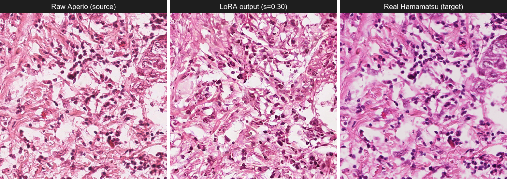
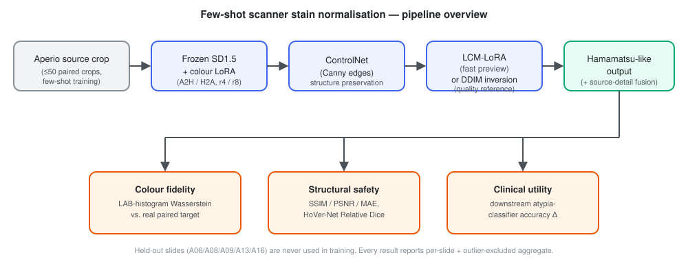
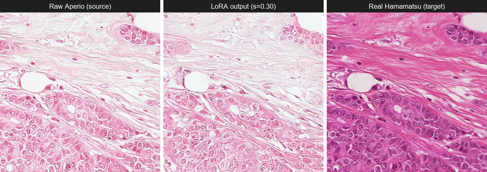

<div align="center">

# Few-Shot Scanner Stain Normalisation

### Diffusion-based H&E stain normalisation across whole-slide scanners

**Aperio &harr; Hamamatsu &middot; Stable Diffusion &middot; LoRA &middot; ControlNet &middot; Computational Pathology**


BSc Honours research project, University of the Witwatersrand. Supervisor: Richard Klein.

</div>



## At a glance

- **Goal:** remove scanner-specific colour variation in H&E histopathology, without disturbing tissue structure
- **Method:** frozen diffusion backbone (Stable Diffusion 1.5) + few-shot colour LoRA + ControlNet + LCM-LoRA
- **Training:** &le;50 coordinate-corresponding crop pairs from a single Aperio/Hamamatsu slide pair
- **Evaluation:** five entirely held-out Aperio/Hamamatsu slide pairs, never seen during training
- **Metrics:** LAB-histogram Wasserstein distance, SSIM/PSNR/MAE, HoVer-Net structural safety, downstream classifier delta
- **Compute:** PyTorch + Slurm HPC (Wits `mscluster`)

## Key results

| | |
|---|---:|
| Held-out evaluation | 496 crops across 5 completely held-out slide pairs |
| Training set | &le;50 few-shot pairs, one slide pair |
| Best structural fidelity (SSIM) | **0.729**, beats every classical baseline |
| vs. classical baselines (SSIM) | Macenko 0.628 &middot; Histogram Matching 0.651 &middot; Reinhard 0.681 |
| Best colour recovery (LAB &Delta;) | **+7.81**, retaining ~89% of the underlying model's colour gain |
| Reproduced on the reverse (H&rarr;A) direction | SSIM 0.548 &rarr; **0.730** |

The headline result (post-hoc source-detail fusion on top of a source-conditioned,
DDIM-inverted colour LoRA) is the first configuration across 37+ tested
configurations in this project to beat classical stain-normalisation methods
outright, not just approach them. Full narrative, per-slide breakdowns, and
every intermediate result: [`docs/results/RESULTS_SUMMARY.md`](docs/results/RESULTS_SUMMARY.md).

## Method



A frozen SD1.5 base is adapted with a **colour LoRA** trained on the few-shot
paired crops, **ControlNet (Canny)** for structural conditioning, and an
**LCM-LoRA** for few-step inference — evaluated against a 50-step DDIM
"quality reference" path. Direction is explicit: `A2H` (Aperio&rarr;Hamamatsu)
and `H2A` (Hamamatsu&rarr;Aperio, for cycle-consistency and downstream-classifier
checks) are trained as separate adapters, each at rank 4 and rank 8.

Full architecture detail, including the source-conditioning/DDIM-inversion
correction and the post-hoc fusion technique behind the headline result:
[`docs/METHOD.md`](docs/METHOD.md).

## Example outputs

From the first full held-out evaluation of the A2H rank-8 colour LoRA
(`eval/a2h_r8/`, strength 0.30) — the best- and worst-scoring crops by
LAB-histogram Wasserstein distance to the real paired Hamamatsu ground
truth, out of 496 scored crops across all 5 held-out slides. Reported as an
honest before/after, not a cherry-picked highlight — the worst case is A06,
this project's confirmed colour-gap outlier, because it genuinely is the
hardest slide, not despite that.

**Best case** (A08, LAB Wasserstein 17.54 — closest match to ground truth):


**Worst case** (A06, LAB Wasserstein 91.12):



## Experimental design

Three phases plus an auxiliary feasibility probe — see
[`docs/EXPERIMENTS.md`](docs/EXPERIMENTS.md) for the full breakdown and
[`docs/phases/`](docs/phases/) for what each phase consumes/produces:

| Phase | Name | What it does |
|---|---|---|
| **Phase 1** | SD1.5 ablation ladder | Ablation rungs A0&ndash;A5, plus the source-conditioning/DDIM-inversion/fusion follow-ons that produced the headline result. |
| **Phase 2** | Evaluation | Colour, structural, clinical, cycle-consistency, and multi-centre generalisation. |
| **Phase 3** | SDXL portability | Transfers the best Phase-1 configuration to SDXL. |
| **Probe** | SD3.5 feasibility | Auxiliary feasibility check &mdash; not a phase, kept out of the main results. |

## Datasets

| Dataset | Path | Phase 1 | Phase 2 | Phase 3 | Role |
|---|---|:--:|:--:|:--:|---|
| **MITOS-ATYPIA-14** | `data/mitos/` | ✅ | ✅ | ✅ | P1: A03/H03 training pairs. P2: held-out A06/A08/A09/A13/A16. P3: same protocol under SDXL. |
| **CAMELYON17** | `data/camelyon17/` | &mdash; | ✅ | &mdash; | 5-centre generalisation only. |
| **TCGA-BRCA** | `data/tcga_brca/` | ✅ | ✅ | &mdash; | P1: 15 slides, warm-start. P2: 10 disjoint slides, LAB colour reference. |
| **PanNuke** | `data/pannuke/` | ✅ | &mdash; | &mdash; | Warm-start only. Excluded from geometry evaluation. |
| **Lizard** | `data/lizard/` | &mdash; | ✅ | &mdash; | HoVer-Net structural safety. |

All datasets are public research releases; no patient-identifiable
information is used. Raw data is not committed to this repo (see
`.gitignore`). Full detail, including why data is organised by dataset
rather than by phase: [`docs/DATASETS.md`](docs/DATASETS.md).

## Repository structure

```
few-shot-scanner-stain-norm/
├── src/
│   ├── data/     dataset extraction/inspection
│   ├── train/    LoRA/ControlNet training scripts
│   └── eval/     registration, metrics, inference, scoring
├── slurm/        one .slurm launcher per script
├── docs/
│   ├── phases/       per-phase reference docs (what each phase reads/writes)
│   ├── results/      archived per-experiment CSVs + RESULTS_SUMMARY.md
│   ├── assets/       README images/diagrams
│   ├── METHOD.md
│   ├── DATASETS.md
│   ├── REPRODUCIBILITY.md
│   └── EXPERIMENTS.md
├── tickets/      live per-phase task board
├── README.md
├── requirements.txt
├── CITATION.cff
└── CLAUDE.md     cluster workflow + AI-agent development notes
```

## Installation

```bash
conda create -n stainnorm python=3.10
conda activate stainnorm
pip install -r requirements.txt
```

Pinned to the exact versions used for this project's results (PyTorch
2.5.1, CUDA 12.1 build). See [`docs/REPRODUCIBILITY.md`](docs/REPRODUCIBILITY.md)
for the full environment setup and known gotchas.

## Reproducing experiments

All training and inference runs on a Slurm HPC cluster, never locally:

```bash
rsync -av ./src ./slurm <cluster>:<remote-code-root>/
ssh <cluster> 'sbatch slurm/train_colour_lora.slurm A2H 8'
ssh <cluster> 'sbatch slurm/infer_colour_lora.slurm a2h_r8 "0.3 0.4 0.5" 0'
ssh <cluster> 'sbatch slurm/score_outputs.slurm a2h_r8'
```

Each `.slurm` script's header comment documents its exact argument usage.
Full workflow, environment, and cluster-specific detail:
[`docs/REPRODUCIBILITY.md`](docs/REPRODUCIBILITY.md).

## Research progress

Detailed experiment logs, per-ticket status, and Slurm job IDs as evidence
are maintained in [`tickets/`](tickets/) — one file per phase, each ticket
citing the proposal section it comes from. `tickets/README.md` explains the
ID scheme and status legend. This is the authoritative source for "what's
actually done"; treat everything above as the stable method description,
not a progress report.

## Citation

Citation metadata is in [`CITATION.cff`](CITATION.cff) — GitHub surfaces
this automatically via the "Cite this repository" button on the repo page.

## Acknowledgements

Supervised by Richard Klein, University of the Witwatersrand. Built on
public research releases: MITOS-ATYPIA-14, CAMELYON17, TCGA-BRCA (via the
GDC), PanNuke, and Lizard — see [`docs/DATASETS.md`](docs/DATASETS.md) for
full attribution.

## License

Not yet finalised &mdash; pending institutional review. Until a license is
added, all rights are reserved by the author.
