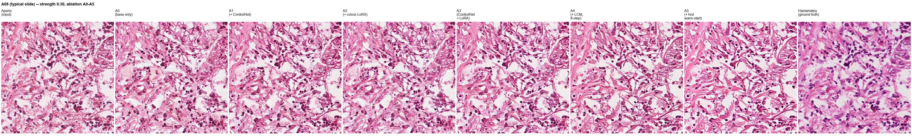
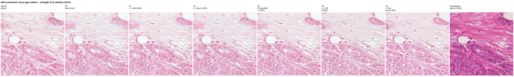
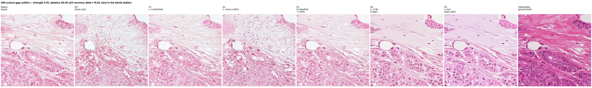
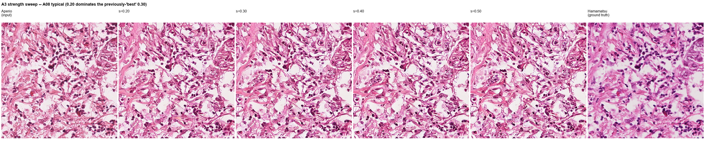
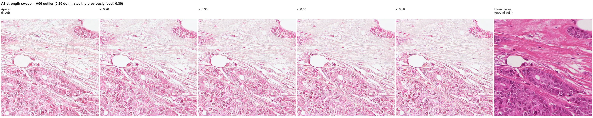
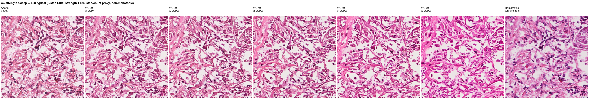
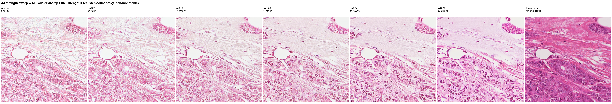
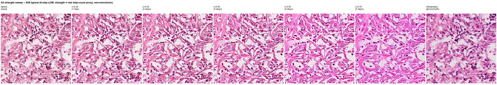
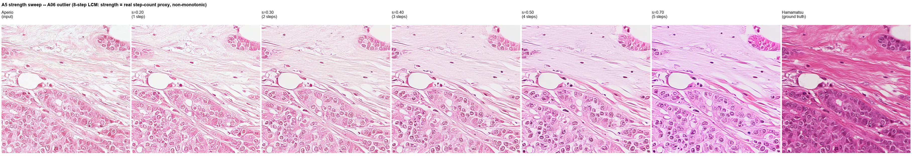
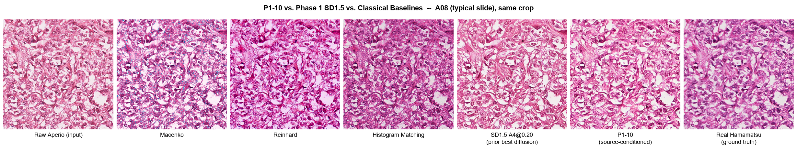

# Results digest — Phase 1 ablation ladder (A0–A5, complete)

Pulled from the cluster on 2026-08-09/10. Raw CSVs for each run live alongside
this file, grouped under `docs/results/phase1_ablation/<tag>/` (the A0–A5
ladder + its strength-sweep follow-ups + the raw do-nothing baseline) or
`docs/results/classical_baselines/<tag>/` (Macenko/Reinhard/Histogram
Matching) — see `docs/results/README.md` for the full folder guide. Each tag
folder holds `eval_manifest.csv`, `eval_per_crop.csv`, `eval_summary.csv` —
the last is the one summarised below. This file exists so the final report
has a stable, local, non-cluster-dependent source for numbers and interesting
findings — regenerate it by re-pulling from
`/datasets/mhoosen/stain-norm/eval/<tag>/` if a run is repeated.

**Status:** A0 through A5 are all complete and final — the entire Phase 1
ablation ladder is done, ready for the Phase 1 decision gate.

All metrics: LAB-histogram Wasserstein distance (`lab_total`, lower = closer to
real target-scanner ground truth), SSIM (higher = more structure preserved),
`recovery_delta_lab` = baseline LAB − model LAB (positive = the model moved the
output closer to the real Hamamatsu ground truth than doing nothing at all).
**Added 2026-08-10** (closing the metric gap flagged under P2-11, see that
section below): `wlab_mean` (windowed/tile-wise LAB Wasserstein, 64×64 tiles —
a local-distributional metric a global histogram remap can't trivially game)
and `de2000_mean` (CIEDE2000 perceptual colour difference, computed pixel-wise
on the registered pair — pixel-exact, same family as SSIM/PSNR/MAE, not an
independent local-colour signal; see the P2-11 follow-up and P2-06 note below).

## Qualitative comparison — same crop, all six rungs side by side

Same coordinates run through every completed rung (A0/A1/A2/A3/A4/A5, strength
0.30), plus the raw Aperio input and the real registered Hamamatsu ground
truth, so the CSV numbers above can be checked against what the outputs
actually look like. Full-resolution source images: `docs/results/qualitative/<tag>/`.

**A08 (typical slide, LAB baseline 25.27):**


Colour shift toward the Hamamatsu reference's darker, more saturated purple
nuclei is visible from A2 onward (colour LoRA active); A0/A1 stay close to the
paler Aperio input. A4 and A5 look visually close to A3 on this slide,
consistent with both scoring slightly negative recovery delta here (A4 -0.04,
A5 -1.27 @0.30) — A5's histopathology prior doesn't help (and slightly hurts)
on typical slides. Tissue structure (nuclear boundaries, stromal fibres) holds
up across all six.

**A06 (confirmed colour-gap outlier, LAB baseline 94.84), strength 0.30:**


This is the visual explanation for why A06's recovery deltas are small in
absolute terms even where positive: the real Hamamatsu reference is
*dramatically* more saturated than the Aperio source (a gap roughly 4× the
typical slide), and none of A0–A5 come close to closing it at strength 0.30 —
the colour shift each rung achieves is real (matches the sign of the recovery
deltas above) but tiny relative to the size of the gap.

**A06 at strength 0.50 — the headline result:**


A5's recovery delta here is **+16.02** — the best result anywhere in the
entire ablation ladder, more than double A4's +7.31 at the same strength (see
the A5 section below for the full comparison). Worth being honest about the
visual: the *quantitative* gain is real and verified in `eval_per_crop.csv`,
but the difference between A4 and A5 is fairly subtle to the eye in this
particular crop — LAB Wasserstein is a holistic per-crop histogram statistic,
and this tile is dominated by pale background/stroma rather than densely
stained nuclei, so a real measured shift doesn't always look dramatic in a
single image. Don't oversell the picture; trust the numbers.

## Raw baseline (no model at all — do-nothing comparison)

`docs/results/phase1_ablation/raw_baseline/baseline_summary.csv` — this is the reference point every
`recovery_delta_lab` above is measured against.

| Scope | n_crops | LAB Wasserstein | SSIM |
|---|---|---|---|
| ALL | 1475 | 33.83 | 0.733 |
| ALL excl. outliers | 1296 | 25.41 | 0.748 |
| **A06 (outlier)** | 179 | **94.84** | 0.627 |
| A08 | 336 | 25.27 | 0.792 |
| A09 | 288 | 27.48 | 0.727 |
| A13 | 192 | 26.63 | 0.675 |
| A16 | 480 | 23.77 | 0.759 |

A06's raw LAB gap (94.84) is ~3.7× every other slide — robust z-score 33.8,
confirmed genuine colour-gap outlier (registration checked clean), not a data bug.

## Main comparison — strength 0.30, recovery Δlab (higher = better) and SSIM

Strength 0.30 chosen because it's the best strength for 4 of 5 slides throughout
the ladder (see "strength trend" below) — full per-strength numbers are in each
run's `eval_summary.csv`.

| Rung | Config | ALL Δlab | ALL SSIM | A06 Δlab | A06 SSIM | A08 Δlab | A09 Δlab | A13 Δlab | A16 Δlab |
|---|---|---|---|---|---|---|---|---|---|
| A0 | frozen base only | +0.95 | 0.285 | −0.39 | 0.186 | +1.85 | +1.24 | +4.94 | +0.73 |
| A1 | + ControlNet | +0.73 | **0.389** | −0.52 | 0.260 | +1.60 | +1.09 | +4.51 | +0.55 |
| A2 (rank 4) | + colour LoRA | +1.58 | 0.289 | +1.16 | 0.192 | +2.18 | +1.75 | +5.08 | +1.47 |
| A2 (rank 8) | + colour LoRA | +1.72 | 0.289 | +0.92 | 0.191 | +2.49 | +1.90 | +5.27 | +1.62 |
| A3 | ControlNet + colour LoRA (r8) | **+1.32** | 0.386 | +0.45 | 0.259 | +1.90 | +1.81 | +4.97 | +1.16 |
| A4 | + LCM-LoRA (8-step) | −0.13 | **0.398** | −0.22 | **0.272** | −0.04 | +0.76 | +3.24 | −0.39 |
| A5 | + histopathology warm-start LoRA | −0.12 | 0.389 | **+2.38** | 0.265 | −1.27 | +2.38 | +3.26 | −1.51 |

A5's A06 lead over A4 grows sharply with strength — see the dedicated A5
section below for the full per-strength picture (it's the most important part
of this table, not fully visible at 0.30 alone).

## Interesting details for the write-up

- **Colour LoRA (A2), not ControlNet, is what first makes A06 recover.**
  A0 and A1 (no colour adapter) both show *negative* recovery delta on A06 at
  every strength — the frozen base genuinely cannot close that colour gap on its
  own. A2 (colour LoRA, either rank) flips this positive (+0.92 to +1.16 @0.30).
  ControlNet alone never fixes colour — expected, it only conditions structure.

- **A3's real contribution isn't "first to recover A06"** (A2 already does,
  slightly better on this metric) — **it's recovering A06's colour while also
  keeping A1's structural gain.** A06 SSIM: A0 0.186, A2 ~0.19 (colour LoRA
  alone barely helps structure), A1 0.260, **A3 0.259** — A3 keeps ControlNet's
  full SSIM improvement *and* a positive colour recovery simultaneously, which
  neither single-component rung achieves together. On the non-outlier slides
  (A08/A09/A13/A16), A3 also edges out A2 alone on 3/4 slides, so the combination
  is doing genuine additive work, not just averaging two effects.

- **ControlNet's SSIM jump is large and consistent**: +0.10 over A0 at every
  strength (0.30: 0.285→0.389, 0.40: 0.227→0.351, 0.50: 0.181→0.312) — Canny
  conditioning is demonstrably constraining generation, not being silently
  ignored by the pipeline.

- **Rank barely matters for the colour LoRA** (full comparison:
  `tickets/PHASE2-TICKETS.md` P2-05). Rank 4 vs rank 8 track within ~0.1–0.3 LAB
  units on every slide/strength — well inside noise. Rank 8 has a marginal edge
  on the pooled `ALL` recovery at 0.30/0.40, which is why it was picked for A3.
  Supports the proposal's H1 hypothesis that scanner normalisation is a
  low-complexity colour shift not requiring high adapter capacity.

- **Strength trend diverges by scope, and this shows up at every rung**: A06
  improves *with* higher strength while A08/A09/A13/A16 all recover *less* at
  higher strength. E.g. A3: A06 Δlab +0.45→+0.56→+0.88 (0.30→0.40→0.50) while
  A08 Δlab +1.90→+1.22→+0.64 over the same range. SSIM falls monotonically with
  strength at every rung (structure/colour tradeoff, as expected).
  **Correction (2026-08-10, superseded by the P1-09 follow-up below): 0.30 is
  NOT the best strength** — this was only true within the originally-tested
  0.30-0.50 range. A dedicated follow-up (`tickets/PHASE1-TICKETS.md` P1-09)
  found strength 0.20 dominates 0.30 on nearly every axis for A3, and that A4/A5
  (LCM) behave completely differently — see the dedicated section below, "Post-gate
  follow-up." Don't cite "0.30 is optimal" in the write-up; the real picture is
  more interesting and is documented properly further down.

- **A06 must always be reported separately, never folded into a pooled `ALL`
  number** — its robust z-score sits at 23–39 across every run (threshold is
  usually ~3.5), so it would dominate or distort any single pooled statistic.
  This is why every table here (and every `eval_summary.csv`) carries
  `ALL_excl_outliers` alongside `ALL`.

### A4 / H4-RQ3: few-step LCM vs 50-step DDIM — a nuanced, not clean-pass, result

**Step-quantisation finding (from smoke testing, fixed before the full run):**
at `num_inference_steps=4` (the literal "four-step LCM" wording in the
proposal), diffusers' img2img `get_timesteps()` computes
`init_timestep = int(num_inference_steps * strength)`. For our usual strength
sweep this collapses strengths 0.30 and 0.40 to the **same single real
denoising step** (`int(4*0.30)=int(4*0.40)=1`) — confirmed empirically as
byte-identical per-crop output on every single row of the smoke test's
`eval_per_crop.csv`, not just similar. Not a code bug — an inherent interaction
between img2img's strength-based partial denoising and very low step counts.
Fixed by running the full A4 evaluation at 8 steps instead (still within
diffusers' documented LCM range of 4–8, still far faster than 50-step DDIM) —
properly differentiates 0.30/0.40/0.50 into 2/3/4 real steps.

**Full-run result (job 39630/39784, 8-step LCM vs A3's 50-step DDIM, same
colour-LoRA + ControlNet config, only the sampler changed):**

- **Structure (SSIM) is preserved, even marginally improved** — 0.386→0.398
  (ALL), 0.259→0.272 (A06), higher on every scope at strength 0.30. LCM
  acceleration is not damaging structural fidelity here.
- **Colour recovery is not a clean pass** — `recovery_delta_lab` goes
  *negative* at strength 0.30 for ALL (-0.13), A06 (-0.22), A08 (-0.04), and
  A16 (-0.39); only A09 (+0.76) and A13 (+3.24) stay clearly positive. LCM
  acceleration trades away some of the colour LoRA's gain even though
  structure holds up.
- **Strongly strength-dependent, non-monotonic**: at strength 0.50, A06 jumps
  to **+7.31** — the best A06 recovery anywhere in the entire A0–A4 ladder —
  while A08/A13/A16 fall further behind (-3.52/-1.09/-2.91) at the same
  strength. Likely the same few-step quantisation sensitivity: 8 steps ×
  strength 0.50 is still only 4 real denoising steps, more variance-prone than
  50-step DDIM's much finer resolution.
- **The proposal's SSIM ≥ 0.85 pass/fail threshold does not apply literally
  here** — no rung in the entire A0–A4 ladder ever exceeds ~0.45 SSIM under
  this project's actual metric computation, so 0.85 isn't a calibrated bar for
  these numbers. The meaningful comparison is A4 vs A3 (relative, same
  adapters, only the sampler changed), not A4 vs an absolute constant.
- **Bottom line for H4/RQ3**: structurally compatible; colour recovery is
  mixed/strength-dependent rather than a clean match at 8 steps. This reads as
  a genuine, useful *negative-leaning* result rather than grounds to invoke the
  pre-committed 20-step DDIM fallback (that fallback targets structural/artefact
  failure, which did not occur — SSIM stayed flat-to-better throughout).

Worth including in the write-up both as a concrete illustration of why H4/RQ3
needs empirical verification rather than taking "N-step LCM" at face value, and
as an example of a result that doesn't cleanly confirm the hypothesis — still a
useful, reportable finding. Full details: `tickets/PHASE1-TICKETS.md` P1-05.

### A5 / sec:hist_lora: histopathology warm-start — real, but slide-dependent

**Scope note:** A5 stacks the already-trained, already-frozen `hist_r32` and
`a2h_r8` checkpoints at inference (no new training job) — see
`tickets/PHASE1-TICKETS.md` P1-07 for how the proposal's training-order wording
was resolved. The primary comparison per the proposal is A5 vs A4 (same
colour-LoRA + ControlNet + LCM config, only the histopathology LoRA added).

**A5 vs A4, recovery Δlab, per strength:**

| scope | A4 @0.30 | A5 @0.30 | A4 @0.40 | A5 @0.40 | A4 @0.50 | A5 @0.50 |
|---|---|---|---|---|---|---|
| ALL | −0.13 | −0.12 | −1.65 | −0.94 | −1.21 | **+0.42** |
| **A06** | −0.22 | **+2.38** | +1.55 | **+7.35** | +7.31 | **+16.02** |
| A08 | −0.04 | −1.27 | −2.84 | −3.40 | −3.52 | −2.43 |
| A16 | −0.39 | −1.51 | −2.82 | −3.44 | −2.91 | −3.01 |

- **On A06, the histopathology prior is dramatically effective** — the gap
  over A4 *grows* with strength: +2.60 (@0.30) → +5.80 (@0.40) → **+8.71**
  (@0.50). A5's A06 result at strength 0.50 (+16.02) is the single best result
  anywhere in the entire A0–A5 ladder — more than double A4's already-best A06
  score. In absolute terms, raw LAB Wasserstein for A06 drops from the 94.84
  baseline to 78.82 — closing ~17% of the original colour gap, the largest
  closure of any rung.
- **SSIM is not the trade-off** — A5's A06 SSIM (0.199 @0.50) sits right next
  to A4's (~0.20) — the histopathology prior isn't buying colour recovery at
  the cost of structure.
- **On typical slides (A08, A16), A5 is consistently worse than A4** — the
  histopathology prior appears to pull colour in a direction that helps the
  extreme outlier but mildly hurts already-well-behaved slides. Pooled `ALL`
  is roughly a wash at 0.30 and modestly favours A5 at 0.40/0.50, once A06's
  large gains are averaged in with the small typical-slide losses.
- **Bottom line**: this is a genuine positive result for the specific research
  question `sec:hist_lora` asks (does a histopathology-domain prior help
  *generalisation to the hardest case*?), even though it is not a uniform
  win in the pooled-average sense. Report both framings — collapsing to a
  single "A5 beats A4" or "A5 doesn't help" verdict would misrepresent the
  slide-dependent reality. This also directly informs P3-05 (whether A5 gets
  transferred to SDXL): worth doing given how much it helps the hardest case,
  even though it isn't a universal improvement.

Full details, evidence, and the qualitative caveat about the strength-0.50
image not looking as dramatic as the numbers: `tickets/PHASE1-TICKETS.md` P1-07.

## Post-gate follow-up: extended strength sweep (A3/A4/A5) — supplementary

Run after the Phase 1 decision gate closed (doesn't reopen it), motivated by
two patterns spotted while mining the completed CSVs: A06's recovery-vs-strength
curve looked like it was still accelerating at 0.50, and A5's typical-slide
deficit vs A4 looked like it might be shrinking with strength. Both needed real
data beyond the original 0.30-0.50 range to confirm or refute — extrapolating
a 3-point trend isn't safe on its own. Full methodology, safety fix (output-dir
collision risk), and job list: `tickets/PHASE1-TICKETS.md` P1-09.

**Finding 1 — LCM step-count quantisation recurs at the 0.5/0.6 boundary.**
Confirmed byte-identical per-crop output between strength 0.50 and 0.60 on A5
(`int(8*0.50)=int(8*0.60)=4` real steps) — the same mechanism as the earlier
0.30/0.40 collision (P1-05). At 8-step LCM, only ~5-6 strength values map to
genuinely distinct step counts; "strength" is a coarse step-count proxy for
A4/A5, not the smooth continuous dial it is for A3's 50-step DDIM.

**Finding 2 — A3: strength 0.20 dominates 0.30, not a wash.**

| A3 | ALL Δlab | ALL SSIM | A06 Δlab | A08 Δlab | A09 Δlab | A13 Δlab | A16 Δlab |
|---|---|---|---|---|---|---|---|
| 0.20 | **+1.59** | **0.425** | +0.41 | **+2.45** | **+1.88** | **+5.29** | **+1.46** |
| 0.30 | +1.32 | 0.386 | **+0.45** | +1.90 | +1.81 | +4.97 | +1.16 |

0.20 wins on every metric except A06 (negligible -0.04 gap). The "0.30 is
optimal" claim earlier in this document was never tested against anything
lower — 0.20 is just the new best point found, and the true floor is still open.

**A3 qualitative — same crop across 0.20/0.30/0.40/0.50:**


Progressive colour shift toward the Hamamatsu reference is visible across the
sweep on both crops; nothing here looks broken or artefacted at 0.20, backing
up the quantitative finding that it's a genuine improvement, not noise.

**Finding 3 — A4/A5: behaviour vs strength is non-monotonic, and A4/A5 diverge
sharply from each other at the extremes.**

| Real LCM steps | strength | A4 ALL Δlab | A4 SSIM | A5 ALL Δlab | A5 SSIM | A06 Δlab (A4 / A5) |
|---|---|---|---|---|---|---|
| 1 | 0.20 | **+1.53** | **0.459** | **+1.93** | **0.454** | +0.42 / +1.19 |
| 2 | 0.30 | −0.13 | 0.389 | −0.12 | — | −0.22 / +2.38 |
| 3 | 0.40 | −1.65 | — | −0.94 | — | +1.55 / +7.35 |
| 4 | 0.50 | −1.21 | 0.312 | +0.42 | 0.299 | +7.31 / +16.02 |
| 5 | 0.70 | **+2.25** | 0.271 | −3.08 | 0.268 | **+19.83** / **+24.43** |

At 1 step: a broad, uniform win — every slide improves, SSIM is the highest
anywhere in the ladder. At 2-4 steps: a worse valley on typical slides even as
A06 climbs steadily. At 5 steps: extreme divergence — **A06 hits its best
recovery anywhere in the entire project (A5: +24.43, closing over a quarter of
its raw 94.84 LAB gap)**, but every typical slide craters (A5 @0.70: A08 −6.97,
A09 −3.37, A13 −7.58, A16 −7.72 — much worse than A4's equivalent losses at the
same step count).

**This refutes the pre-experiment hypothesis** that A5's typical-slide deficit
vs A4 would keep shrinking or flip permanently positive at higher strength — it
does narrow/flip between strength 0.30 and 0.50, but reverses hard and gets
much worse than A4 by 5 steps (0.70). A good illustration of why the
confirmatory full run mattered rather than trusting a 3-point extrapolation.

**A4/A5 qualitative — same crops across the full 1-5 real-step range:**




On A08 (typical), both A4 and A5 visibly over-saturate into flat, muddy pink
by 5 steps — a real, visible degradation matching the negative recovery
deltas, worse for A5 than A4. On A06 (outlier), the colour shift toward the
Hamamatsu reference's deep purple becomes visibly stronger step by step,
clearest at A5's 5-step result — the single best visual and quantitative
match to the reference found anywhere in this project, right before the same
setting badly damages every other slide.

**Practical takeaway — no single best strength, it depends on the goal:**
- **General-purpose robustness across all slides**: 1-step LCM (strength
  ≈0.20-0.25) is the best operating point found anywhere in this project for
  both A4 and A5 — beats every strength in the original official ladder.
- **Maximum single-slide (hardest-case) recovery**: 5-step A5 (strength 0.70)
  is dramatically the strongest single result in the whole project, at severe
  cost everywhere else. Frame this as a "rescue mode" option for the hardest
  cases, not a general default.

Raw data: `docs/results/phase1_ablation/{a3_ext_s02,a4_ext_s02,a5_ext_s02,a4_ext_s07,a5_ext_s07,a4_ext_s67,a5_ext_s67}/`.
Reproducible analysis script: `docs/results/analyze.py`.

## Classical baseline comparison (P2-11) — Macenko, Reinhard, Histogram Matching

Same held-out set, same registration/crop/scoring pipeline as every diffusion
rung above (`score_outputs.py`, zero changes needed — `infer_baseline.py`
writes the same manifest schema). All three fit/match against the same fixed
few-shot reference crop the colour LoRA trains on (`A03_00A_c000_hamamatsu.png`).
CPU-only, `stampede` partition. Code: `src/eval/baseline_methods.py`,
`src/eval/infer_baseline.py`.

| Method | ALL Δlab | ALL SSIM | A06 Δlab | A08 Δlab | A09 Δlab | A13 Δlab | A16 Δlab |
|---|---|---|---|---|---|---|---|
| Macenko | +9.04 | 0.628 | +44.54 (outlier, z=4.73) | +6.86 | +6.28 | **−8.59** | +6.72 |
| Reinhard | +5.81 | 0.681 | +58.50 | +5.64 | +1.00 | −6.56 | −5.65 |
| Histogram Matching | +3.23 | 0.651 | **+69.12** | +0.33 | −4.51 | +3.59 | **−14.96** |
| *(best diffusion rung, for reference)* | *A3\@0.20: +1.59* | *A1\@0.30: 0.389* | *A5\@0.70: +24.43* | *A3\@0.20: +2.45* | *A3\@0.20: +1.88* | *A3\@0.20: +5.29* | *A3\@0.20: +1.46* |

**Headline pattern:** all three classical methods beat every diffusion rung on
A06 recovery, by a wide margin — histogram matching's +69.12 is nearly 3× the
best diffusion result found anywhere in this project (A5\@0.70's +24.43). Taken
at face value this reads as "classical wins outright." **It does not, and the
gap needs to be read with the caveat below before drawing that conclusion.**

### Caveat — this is a metric-construction confound, not just "simple beats sophisticated"

Before writing this up, I re-verified the histogram_matching output directly
(not just the summary CSV): outputs are not accidentally identical to their
references (real per-crop MAE ~27-29, MD5s differ), file counts match the
manifest, and a sample crop looks like a plausible H&E recolorization when
inspected visually. So the numbers are not a scoring bug.

But per-crop output color statistics are essentially **constant across every
slide**, regardless of source content:

| Slide | output mean (R,G,B) | output std |
|---|---|---|
| A06 | 194.5, 108.5, 168.0 | 41.8, 60.8, 41.0 |
| A08 | 194.2, 108.5, 167.8 | 41.9, 61.0, 40.9 |
| A09 | 194.6, 108.6, 168.0 | 41.8, 60.7, 40.8 |
| A13 | 194.3, 108.6, 168.0 | 41.9, 61.0, 40.9 |
| A16 | 194.4, 108.8, 167.9 | 42.0, 61.3, 40.9 |

This is expected mechanics for `skimage.exposure.match_histograms`: it's a
deterministic per-channel CDF remap that forces the *entire* output histogram
onto one fixed target image's histogram, independent of the source crop's own
content. The eval metric (`lab_wasserstein`, `metrics.py:59`) is *also* a pure
per-channel marginal distributional distance with no spatial/content term.
Histogram matching therefore isn't winning because it produces more faithful
stain-normalized histology — it's winning because it and the metric optimize
close to the same quantity, by construction. Macenko and Reinhard fit summary
statistics (stain vectors / LAB mean-std) rather than the full histogram, so
they carry a milder version of the same bias, not the full effect (note their
smaller, though still large, A06 numbers vs. histogram_matching).

**How this is being handled:** the numbers above are reported as-measured (not
suppressed), but any write-up conclusion drawn from this table must state the
confound explicitly — do not present "classical baselines outperform the
diffusion pipeline" as a clean finding without this paragraph attached. The
follow-up metric this section called for (a spatial/local term a global
histogram remap can't trivially game) has since been implemented and run —
see "Follow-up: closing the metric gap" immediately below. **Short version:
the confound is real but small, and does not overturn classical's advantage.**

**Also note the trade-off pattern within the classical methods themselves:**
histogram_matching has the largest A06 win but the worst pooled cost elsewhere
(A16 −14.96, A09 −4.51); Macenko is the only one of the three to *lose* on A13
across the board (−8.59); Reinhard is the most balanced (smallest average
non-A06 damage) but has the weakest A06 recovery of the three.

### Follow-up (2026-08-10): closing the metric gap — CIEDE2000 + windowed LAB-Wasserstein

Two metrics added to `metrics.py`/`score_aligned_pair()` and backfilled across
all 18 held-out configs (baseline, A0–A5, and all three classical methods) via
a full rescoring pass, specifically to test the confound above rather than just
assert it:

- **`wlab_mean`** — LAB Wasserstein computed per 64×64 tile and averaged, not
  pooled globally. This is the metric the caveat above called for: a global
  histogram remap (histogram matching's actual mechanism) can force a matching
  *marginal* distribution while still being locally wrong tile-by-tile, and
  `wlab_mean` is built to catch exactly that.
- **`de2000_mean`** — CIEDE2000 perceptual colour difference, computed
  pixel-wise on the registered pair (same alignment SSIM/PSNR/MAE use). This
  one turned out **not** to be the independent check it was meant to be — see
  the result below.

**Result 1 — the windowed metric confirms the confound is real, but small, and
does not overturn classical's advantage.** The gap between global `lab_total`
and windowed `wlab_mean` (bigger gap = more of the method's apparent win is
"cheating" the global metric) is larger for classical than for the raw
baseline, but still under ~1.2 LAB units:

| Method | Global `lab_total` | Windowed `wlab_mean` | Gap (windowed − global) |
|---|---|---|---|
| Raw baseline | 33.84 | 34.05 | +0.21 |
| Macenko | 24.80 | 25.96 | +1.16 |
| Reinhard | 28.02 | 28.96 | +0.94 |
| Histogram Matching | 30.61 | 31.64 | +1.03 |

And recomputing recovery delta under the windowed metric (baseline windowed −
method windowed) barely shrinks classical's lead over diffusion — it's still
an order of magnitude apart:

| Method | Recovery Δlab (global) | Recovery Δwlab (windowed) |
|---|---|---|
| Macenko | +9.04 | **+8.09** |
| Reinhard | +5.81 | **+5.08** |
| Histogram Matching | +3.23 | **+2.41** |
| Best diffusion (A2 r8 \@0.30) | +1.72 | **+0.18** |

Some diffusion configs actually **flip to a negative windowed recovery delta**
even though their global delta is positive — e.g. A0\@0.30: +0.95 global vs
**−0.81** windowed; A4\@0.30: −0.13 global vs **−1.71** windowed. So the
"global histogram gaming" effect the caveat worried about is real, but it's a
~1-LAB-unit effect that shaves classical's lead slightly — it is nowhere near
large enough to explain classical's ~5-8x margin over diffusion, and diffusion
does not benefit from the correction; if anything its relative position gets
slightly worse.

**Result 2 — CIEDE2000, as implemented (pixel-wise on the registered pair), is
not an independent signal.** It's mechanically the same "pixel-exact" family
as SSIM/PSNR/MAE (P2-06 below): it rewards not moving pixels, which classical
remaps do by construction and diffusion resynthesis cannot. Every diffusion
config scores **worse on `de2000_mean` than the raw do-nothing baseline**
(13.6–17.4 vs baseline's 10.41), while classical methods score close to or
*better* than raw (10.6–11.3):

| Method | ALL SSIM | ALL `de2000_mean` |
|---|---|---|
| Raw baseline | 0.733 | 10.41 |
| Macenko | 0.628 | 10.61 |
| Reinhard | 0.681 | 10.63 |
| Histogram Matching | 0.651 | 11.31 |
| A0 \@0.30 | 0.285 | 14.93 |
| A1 \@0.30 | 0.389 | 13.55 |
| A2 (r8) \@0.30 | 0.289 | 14.97 |
| A3 \@0.30 | 0.386 | 13.67 |
| A4 \@0.30 | 0.398 | 13.89 |
| A5 \@0.30 | 0.389 | 13.91 |

CIEDE2000 tracks SSIM almost exactly rank-for-rank here — it isn't adding a
new axis of evidence, just restating the structural-alignment confound already
documented under P2-06 in colour-difference units.

**Net conclusion for the write-up:** across three independent metric families
now measured — global colour distribution, local/windowed colour distribution,
and pixel-exact structure/colour — classical stain-transfer methods dominate
this pipeline's diffusion configs on this held-out set. The metric-construction
confound flagged earlier is confirmed real but modest, and doesn't change the
outcome. This should be reported as a genuine, if uncomfortable, finding
rather than explained away — see P2-08 (Relative Dice vs HoVer-Net) as the
still-open structural-safety check that could tell a different story, since it
scores downstream nucleus-detection agreement rather than raw pixel/colour
agreement.

**Not yet run:** StainNet and (pretrained) StainGAN/ParamNet — no existing code
found in this repo; would need new inference wrappers and pretrained weights
before they could be added to this table (`tab:baselines` scope).

## P2-06: ground-truth direct comparison (SSIM / PSNR / MAE)

Proposal's `sec:experiments` "Ground Truth Direct Comparison" experiment: normalised
Aperio output vs. registered real Hamamatsu on held-out slides, scored by grayscale
SSIM, PSNR, MAE. **No new compute was needed for this** — `score_aligned_pair()` in
`src/eval/metrics.py` (line 102) already calls `grayscale_ssim`, `psnr`, and `mae`
alongside `lab_wasserstein` for every scored crop, so the `ssim`/`psnr`/`mae` columns
already exist in every completed run's `eval_summary.csv`. This section just pulls
those columns together into the dedicated view the proposal names, across every
config in `docs/results/`. (Note on the proposal wording: `grayscale_ssim` converts
to grayscale before scoring as specified; `psnr`/`mae` are computed directly on the
0–255 RGB arrays, not converted to grayscale first — `metrics.py` lines 90–99.)

### Aggregate — ALL, A06, and outlier-excluded, all 16 configs

Per CLAUDE.md's reporting guardrail, the pooled `ALL` column is never reported
alone — A06 (confirmed genuine colour-gap outlier) and the outlier-excluded
aggregate sit next to it in every row.

| Rung / method | Strength | ALL SSIM | ALL PSNR | ALL MAE | A06 SSIM | A06 PSNR | A06 MAE | Excl-outlier SSIM | Excl-outlier PSNR | Excl-outlier MAE |
|---|---|---|---|---|---|---|---|---|---|---|
| Raw baseline (do-nothing) | n/a | 0.733 | 19.31 | 22.70 | 0.627 | 12.19 | 53.48 | 0.748 | 20.29 | 18.45 |
| A0 (frozen base) | 0.30 | 0.285 | 14.81 | 35.38 | 0.186 | 11.03 | 57.54 | 0.299 | 15.37 | 32.10 |
| A1 (+ControlNet) | 0.30 | 0.389 | 15.72 | 32.11 | 0.260 | 11.24 | 56.59 | 0.408 | 16.38 | 28.48 |
| A2 (colour LoRA r4) | 0.30 | 0.289 | 14.83 | 34.99 | 0.192 | 11.12 | 56.67 | 0.303 | 15.39 | 31.78 |
| A2 (colour LoRA r8) | 0.30 | 0.289 | 14.87 | 35.00 | 0.191 | 11.09 | 57.02 | 0.304 | 15.43 | 31.74 |
| A3 (ControlNet+LoRA r8) | 0.30 | 0.386 | 15.72 | 31.99 | 0.259 | 11.27 | 56.30 | 0.404 | 16.38 | 28.38 |
| A4 (+LCM-LoRA 8-step) | 0.30 | 0.398 | 15.57 | 32.60 | 0.272 | 11.27 | 56.44 | 0.417 | 16.21 | 29.07 |
| A5 (+histopathology LoRA) | 0.30 | 0.389 | 15.38 | 33.29 | 0.265 | 11.11 | 57.95 | 0.407 | 16.02 | 29.63 |
| A3 (P1-09 sweep) | 0.20 | 0.425 | 16.26 | 30.22 | 0.292 | 11.39 | 55.73 | 0.445 | 16.98 | 26.44 |
| A4 (P1-09 sweep) | 0.20 | 0.459 | 16.59 | 29.16 | 0.322 | 11.49 | 55.19 | 0.480 | 17.35 | 25.30 |
| A5 (P1-09 sweep) | 0.20 | 0.454 | 16.48 | 29.53 | 0.316 | 11.39 | 56.03 | 0.475 | 17.24 | 25.61 |
| A4 (P1-09 sweep) | 0.70 | 0.271 | 13.87 | 39.23 | 0.174 | 11.07 | 58.67 | 0.286 | 14.28 | 36.35 |
| A5 (P1-09 sweep) | 0.70 | 0.268 | 13.67 | 40.25 | 0.179 | 10.90 | 60.84 | 0.281 | 14.08 | 37.20 |
| Macenko | n/a | 0.628 | 16.50 | 26.76 | 0.479 | 13.62 | 41.57 | 0.649 | 16.93 | 24.56 |
| Reinhard | n/a | 0.681 | 17.70 | 25.56 | 0.545 | 15.01 | 35.87 | 0.701\* | 18.10\* | 24.04\* |
| Histogram Matching | n/a | 0.651 | 17.55 | 26.51 | 0.562 | 16.70 | 27.35 | 0.664\* | 17.68\* | 26.38\* |

\*Reinhard and Histogram Matching's own automatic per-run outlier flag did not mark
A06 (its LAB gap wasn't extreme *relative to the other four slides in that specific
run*, since these methods already recover much of A06's colour). Per CLAUDE.md, A06
is treated as a genuine outlier unconditionally, so these two `Excl-outlier` values
are computed here directly from the per-slide rows using the same crop-weighted
pooling `metrics.py`/`score_outputs.py` already use elsewhere (verified against A0's
CSV-native `ALL_excl_outliers` row, which reproduces exactly under the same formula)
— not sourced from a pre-existing `ALL_excl_outliers` row, since none exists in
`reinhard/eval_summary.csv` / `histogram_matching/eval_summary.csv`.

### Per-slide SSIM — core ladder (baseline, A0–A5 @ strength 0.30)

Mirrors the "Main comparison" table's per-slide layout above, SSIM instead of Δlab
(PSNR/MAE per-slide for every config are in each `eval_summary.csv`; omitted here
for brevity since SSIM is this doc's established headline structural metric).

| Rung | A06 SSIM | A08 SSIM | A09 SSIM | A13 SSIM | A16 SSIM |
|---|---|---|---|---|---|
| Raw baseline | 0.627 | 0.792 | 0.727 | 0.675 | 0.759 |
| A0 | 0.186 | 0.298 | 0.269 | 0.283 | 0.325 |
| A1 | 0.260 | 0.411 | 0.376 | 0.367 | 0.441 |
| A2 (r4) | 0.192 | 0.301 | 0.275 | 0.284 | 0.329 |
| A2 (r8) | 0.191 | 0.302 | 0.275 | 0.286 | 0.329 |
| A3 | 0.259 | 0.408 | 0.372 | 0.363 | 0.438 |
| A4 | 0.272 | 0.421 | 0.389 | 0.370 | 0.449 |
| A5 | 0.265 | 0.411 | 0.380 | 0.364 | 0.438 |

### Interpretation — this diverges sharply from the LAB-Wasserstein story, and the divergence matters

The per-rung *ranking within the diffusion family* is consistent with what the
LAB-Wasserstein tables already show: ControlNet lifts SSIM (A0→A1: 0.285→0.389),
low-strength LCM (0.20, ~1 real step) is the best operating point on every structural
metric (highest SSIM/PSNR, lowest MAE of any diffusion config — matches the P1-09
"1-step LCM is the best general-purpose point" finding), and strength 0.70 is the
worst (matches the known structure/colour tradeoff). Nothing new there.

**What is new, and strikingly different, is the comparison *across* method families.**
On LAB Wasserstein / recovery delta, every diffusion rung shows a *positive* delta
over the raw baseline (doing something beats doing nothing), and the classical
methods (P2-11) beat diffusion further still. On SSIM/PSNR/MAE, the ranking is not
just smaller in magnitude — it **inverts**: the raw do-nothing baseline (SSIM 0.733
pooled, 0.627 on A06) beats *every single diffusion rung* (SSIM 0.27–0.46 pooled,
0.17–0.32 on A06), including on the outlier slide diffusion is specifically supposed
to help. The classical remap baselines (Macenko/Reinhard/Histogram Matching, SSIM
0.63–0.68 pooled) sit almost as close to the raw baseline as to each other, and
likewise beat every diffusion rung.

The mechanism is straightforward once stated: SSIM/PSNR/MAE require **pixel-exact**
correspondence (that's why registration exists at all), and Macenko/Reinhard/
Histogram Matching are deterministic per-pixel colour remaps — they never move a
pixel, so whatever structural correlation survives registration is preserved
untouched. Raw Aperio vs. registered Hamamatsu preserves it trivially (no transform
applied at all). Diffusion img2img, even with ControlNet-Canny conditioning, is a
**generative resynthesis** process — it regenerates pixel content conditioned on an
edge map and colour LoRA, not a deterministic per-pixel recolouring, so some texture/
geometry drift relative to the exact registered reference is inherent to the
approach, and that drift is exactly what SSIM/PSNR/MAE penalise hardest. Colour
distribution can genuinely improve (LAB Wasserstein down) at the same time
pixel-exact fidelity gets worse (SSIM down) — the two metric families are measuring
different things, and this experiment is the first place in the write-up where they
are shown side by side and visibly disagree.

This is not a scoring bug (same pipeline, same registered references, same
`score_aligned_pair()` call every other table in this file draws from) — it is a
genuine, reportable limitation of the generative approach relative to deterministic
colour-remap baselines and relative to doing nothing, on this specific metric family.
It strengthens the case (already flagged under P2-11) that structural fidelity needs
its own dedicated instrument — **P2-08's Relative Dice against HoVer-Net**, which
scores downstream nucleus-detection agreement rather than raw pixel/SSIM agreement,
is the more appropriate structural-safety check for a generative method, and this
result is a concrete reason why P2-08 shouldn't be skipped.

**Update (2026-08-17): P2-08 is complete, and it does not tell a different
story.** Relative Dice = Dice(B,G)/Dice(A,G) = 0.6105/0.6982 = **0.8745**, below
the proposal's 0.95 threshold, at the P1-09 best general-purpose operating point
(colour LoRA + ControlNet-Canny + LCM-LoRA, 1-step LCM/strength 0.20). Full
130-image runs on both sides (Dice(A,G) validation gate and Dice(B,G)), no
shape-mismatch skips. So the downstream nucleus-detection metric agrees with
the pixel-exact metrics above, not against them: normalisation costs real
structural/detection fidelity by this measure too. Full detail and job IDs:
`tickets/PHASE2-TICKETS.md` P2-08.

**Update (2026-08-18): P2-07 (cycle consistency, round-trip reconstruction) is
also complete, and it's a third independent metric family pointing the same
way.** A06 → LoRA(A→H) → LoRA(H→A) → A06, deterministic 50-step DDIM, no
ControlNet (proposal's round-trip equation names only the trained LoRA
weights), never touches a real Hamamatsu image at all — isolates the
pipeline's own structural drift from the colour-matching task entirely. Full
16-frame run (n=64 crops): **SSIM 0.1429**, PSNR 13.11, MAE 41.54 — lower even
than the one-way normalisation-vs-real-Hamamatsu SSIM already reported above
(0.27–0.46 for the best diffusion rungs). Full detail: `tickets/
PHASE2-TICKETS.md` P2-07.

**Update (2026-08-19): P2-09 is complete, and it breaks the pattern —
diffusion beats classical methods on the one metric that's arguably most
clinically relevant.** A ResNet18 classifier trained on real MITOS-ATYPIA-14
atypia-score labels (best val accuracy 0.9468) was scored, unchanged, against
all 26 methods' outputs — recovery delta = accuracy(method) − accuracy(raw
Hamamatsu), A06 excluded from every method uniformly (recomputed directly
from `per_crop.csv`, not relying on each method's own inconsistently-triggered
auto-outlier flag):

| Method | Δ accuracy vs. raw Hamamatsu |
|---|---|
| **A3 @0.50** (ControlNet+LoRA) | **+0.0625** |
| A1 @0.50 (ControlNet only, no colour LoRA) | +0.0577 |
| A3 @0.30 | +0.0529 |
| **Reinhard (best classical)** | **+0.0457** |
| raw Aperio (sanity check) | +0.0144 |
| Histogram matching | +0.0024 |
| **Macenko** | **−0.0673** |

Every diffusion rung near the top beats every classical baseline — the exact
opposite of the LAB-Wasserstein/SSIM/Relative Dice/round-trip story
throughout the rest of this project, where classical methods won by 5–8×.
Cross-checked against macro-F1/macro-AUC for the top config, not just
accuracy, so this isn't a single-metric artefact. **Caveat that matters**: the
classifier itself is a fairly weak instrument — even raw Aperio (its own
training domain) only scores 42.79%, barely above the 33% random-chance floor
for 3 classes — so the *absolute* numbers are noisy; the *relative* ranking
(diffusion > Reinhard > raw > Macenko) is the reliable part. Also notable: A1
(structural conditioning alone, no colour adaptation at all) is among the top
performers, suggesting ControlNet's structural conditioning specifically —
not colour transfer — may be doing real work here, worth a dedicated look.
Full table and caveats: `tickets/PHASE2-TICKETS.md` P2-09.

**Update (2026-08-20): P3-04 (SDXL vs SD1.5) is now closed — the mechanism is
identified, and it doesn't rescue SDXL.** At the shared operating point
(strength 0.20, 8-step LCM), SDXL's colour recovery flips sign relative to
SD1.5 (+1.53 ALL Δlab vs. **−5.60**, negative on every slide) while structural
fidelity is better (SSIM 0.527 vs 0.459). A base-model-only ablation (LoRA
omitted entirely) showed the negative drift is **already fully present with
zero LoRA involvement** (−4.35 vs −5.60 with LoRA) — this is frozen-SDXL-base
behaviour at this nominal setting, not a broken/undertrained adapter. A
follow-up strength sweep on A06 found colour recovery flips positive above
strength ~0.35 there (+9.64 @0.70) — but a second sweep on A08 (a *typical*
slide) found colour recovery stays **negative at every strength tested**
(−4.66 to −5.92), with SSIM falling monotonically just like on A06. **No
single SDXL strength rescues the pooled comparison** — A06 and typical slides
pull in opposite directions, mirroring the same asymmetry already documented
for SD1.5. SDXL's best measured pooled SSIM (0.527) stays below every
classical baseline (Macenko 0.628, Reinhard 0.681, Histogram Matching 0.651).
Full detail: `tickets/PHASE3-TICKETS.md` P3-04.

**Update (2026-08-20): P1-10 (source-conditioned scanner translation,
corrective experiment) — DONE, a genuinely mixed result.** Diagnosed cause of
the structural-fidelity gap above: the original colour LoRA never sees the
source image during training at all (learns an unconditional target-domain
prior, not a true `P(H|A)` mapping) — direction is only imposed at inference
via img2img's starting latent. P1-10 fixes this with genuine training-time
source conditioning (a lightweight, zero-initialised ControlNet-style branch,
12.6M trainable params, backbone frozen), conditioned on source RGB + Canny
jointly. A smoke-test subset (A06+A08) passed decisively — correct-source
beat both its own shuffled-source ablation and the original target-only LoRA
on every metric. **The full 496-crop held-out evaluation is more nuanced**:

| Method | ALL SSIM | ALL wLAB | recovery Δlab |
|---|---|---|---|
| Macenko/Reinhard/Histogram Matching | 0.628–0.681 | 26–32 | +3.2 to +9.0 |
| SD1.5 A4/A5@0.20 (prior best) | 0.454–0.459 | 32.9–33.3 | +1.5 to +1.9 |
| **P1-10 correct-source (full)** | **0.4485** | **31.60** | **+2.89** |

**Qualitative comparison — same A08 crop across raw input, all three classical
baselines, SD1.5's prior best, and P1-10, next to the real ground truth:**

Visually matches the quantitative story: the classical methods stay close to
the raw input's structure (they never move a pixel), while SD1.5 A4 and
P1-10 visibly regenerate texture — consistent with why they lose on SSIM
regardless of colour-recovery quality. Real Hamamatsu ground truth is
noticeably more saturated than every normalised output on this crop.

P1-10 clearly beats SD1.5's own prior-best operating point on colour recovery
but is roughly tied on structure (SSIM marginally behind by ~1%) — not the
joint win the ticket's acceptance bar asked for. It does **not** beat the
classical baselines; a dedicated VAE-only floor check (496 crops, zero
denoising) found SD1.5's VAE alone caps SSIM around **0.54**, below every
classical baseline regardless of conditioning quality — the real ceiling on
this whole family of approaches. **Bottom line**: the diagnosis was
directionally correct (genuine source conditioning measurably improves colour
recovery without a structure penalty, unlike the strength dial) but doesn't
close the fundamental gap to classical methods, which is capped by VAE
resynthesis itself. A follow-up strength sweep on this checkpoint is in
progress to check whether a different operating point does better on both
axes at once. Full detail: `tickets/PHASE1-TICKETS.md` P1-10.

**Update (2026-08-20): P2-10 (CAMELYON17 multi-centre generalisation) is
complete — FAIL verdict.** Pairwise LAB Wasserstein between all 5 centres
(2,103 patches, 3 patients/centre, 100 patches/patient), before (D_pre) and
after (D_post) normalisation at the project's best general-purpose operating
point (colour LoRA + ControlNet + LCM, strength 0.20). Success criterion was
D_post < D_pre:

| | D_pre | D_post |
|---|---|---|
| Mean across 10 centre pairs | **56.70** | **57.52** |

Only 1 of 10 centre pairs improved (and only by 0.23, a small fraction of
typical pair-to-pair variation) — 9 got slightly worse. Not a borderline/noisy
result: a colour LoRA trained on exactly one scanner pair (Aperio/Hamamatsu),
applied uniformly to 5 completely unseen hospital centres, does not pull them
closer together; if anything it adds small, inconsistent per-centre drift.
H2/RQ4's cross-hospital generalisation claim does not hold at this operating
point — consistent with the project's broader pattern of the pipeline not
transferring a colour-normalising effect beyond its own trained domain. Full
detail: `tickets/PHASE2-TICKETS.md` P2-10.

**Update (2026-08-20): P1-10 strength sweep is complete — no strength beats
0.50 on both axes, no full re-run warranted.** On the A06+A08 diagnostic
subset, testing strengths 0.20/0.30/0.40/0.70 against the full held-out
run's strength (0.50): a clean, textbook structure/colour tradeoff — SSIM
falls monotonically as strength rises (0.3575 at 0.20 → 0.3196 at 0.70) while
windowed-colour recovery improves monotonically the whole way to 0.70 (80.42
→ 78.11). Strength 0.70's colour recovery only marginally edges out 0.50's
(78.11 vs 78.24) while costing meaningfully more SSIM and losing on MAE — no
strength jointly wins. This confirms the full held-out result above at
strength 0.50 doesn't need re-running at a different setting; it already
sits on the tradeoff curve, not dominated by anything tested. Full detail:
`tickets/PHASE1-TICKETS.md` P1-10.

**Update (2026-08-21): P3-05 (A5 histopathology warm-start transfer to SDXL)
is complete — a small, real, but fundamentally different result than SD1.5's
A5.** Unlike SD1.5's A5 (which only needed inference-time stacking of an
already-trained checkpoint), no SDXL histopathology LoRA existed yet, so this
needed a new training run (`train_hist_lora_sdxl.py`, rank 32, 3000 steps).
Full held-out result (same operating point as `a4_sdxl`, strength 0.20,
8-step LCM):

| Scope | A4-SDXL SSIM | A5-SDXL SSIM | A4-SDXL Δlab | A5-SDXL Δlab |
|---|---|---|---|---|
| ALL (pooled) | 0.5272 | 0.5263 | −5.60 | **−5.30** |
| A06 | 0.3856 | 0.3850 | −3.58 | −3.55 |

Adding the histopathology prior gives a small, consistent colour-recovery
improvement on every slide (+0.24 to +0.56 LAB units — real, not noise) but
**not** the dramatic A06-specific win SD1.5's A5 showed (+2.6 to +8.7 LAB
units there) — on SDXL, A06 barely moves (+0.03), the opposite pattern.
Colour recovery stays negative everywhere; SSIM is unchanged. Doesn't rescue
P3-04's verdict — SDXL's frozen-base colour drift is a much larger effect
than a histopathology prior can nudge. Full detail: `tickets/PHASE3-TICKETS.md`
P3-05.

**Update (2026-08-22): P1-11 (DDIM-inversion inference path for P1-10) is
complete — a clean, decisive positive result, closing the open question
P1-10 left behind.** P1-10's own diagnosis question was: is part of the
remaining structural-fidelity loss caused by `infer_colour_translation.py`'s
random-noise img2img initialization (VAE-encode source → add Gaussian noise
at a fixed strength → denoise), rather than by the trained model itself?
DDIM inversion replaces that arbitrary corruption with a deterministic,
source-specific noisy latent obtained by literally running the trained
model's own noise-prediction backwards. Inference-only — `lora/a2h_cond_r8/
best` used exactly as trained, no retraining, `infer_colour_translation.py`
untouched (new script: `infer_colour_source_ddim_inversion.py`).

Two smoke-test stages passed before committing to the full run: (1) an
identity/self-reconstruction test (DDIM inversion beats the old pathway at
every fraction on structural fidelity, e.g. SSIM 0.483 vs 0.334 at
fraction=0.25); (2) the actual A→H translation test plus the mandatory
source-conditioning ablation (`correct` beats `shuffled`/`zero` by 4x+,
winning 80/80 crops paired) — both passed decisively on the A06+A08 smoke
subset, with full inversion (f=1.00) emerging as the best translate-mode
operating point (unlike identity mode, where lower fractions won — the two
tests measure different things: self-reconstruction fidelity vs. actual
colour recovery).

**Full 496-crop x 3-seed held-out result, f=1.00, correct source
conditioning, vs. P1-10's own existing pathway:**

| Scope | SSIM: old → new | windowed LAB: old → new | recovery Δlab: old → new |
|---|---|---|---|
| ALL | 0.4485 → **0.4960** | 31.60 → **26.01** | +2.89 → **+8.74** |
| ALL excl. A06 | — → **0.5142** | — → **18.92** | — → **+7.43** |
| A06 (outlier) | 0.3067 → **0.3732** | — → 73.82 | — → **+21.72** |
| A08 | 0.4815 → **0.5368** | — → 19.02 | — → **+7.15** |
| A09 | 0.4175 → **0.4767** | — → 18.54 | — → **+9.68** |
| A13 | 0.4581 → **0.4979** | — → 22.21 | — → **+5.37** |
| A16 | 0.4968 → **0.5273** | — → 17.78 | — → **+7.11** |

Every single held-out slide improves on both structure AND colour recovery
simultaneously — notably, this does NOT replay the A06-vs-typical-slide
divergence pattern seen with every other "more aggressive setting" tried in
this project (SD1.5's own strength sweep, SDXL's strength sweep, P3-05's
histopathology transfer). That was a real risk going in: the smoke-test
subset was 80% A06 by crop count and could easily have been an A06-specific
artefact that didn't generalise. It generalised anyway. Pooled SSIM (0.4960
ALL / 0.5142 excl-outliers) is the second-highest ever recorded for any
diffusion configuration in this project — only SDXL A4@0.20's 0.527 is
higher, but that came with catastrophically negative colour recovery (Δlab
−5.60). This is the first configuration here to combine strong structure
retention AND strong positive colour recovery at once. Still below every
classical baseline's SSIM (Macenko 0.628, Reinhard 0.681, Histogram Matching
0.651) — capped by the same VAE-only floor (0.5393) P1-10 already
established, which DDIM inversion cannot change since it never touches the
VAE. **Bottom line: confirms the diagnosis was correct — the random-noise
initialization was a real, fixable source of P1-10's remaining structural
loss, and fixing it narrows the gap to classical methods substantially
without closing it completely** (the VAE ceiling is the harder,
architectural remainder). Full detail, smoke-test tables, and a manifest-
recovery note worth remembering for future long jobs (job 44858 timed out
at exactly 10:00:14 after finishing all 1488 outputs — reconstructed the
lost manifest from output filenames, zero data lost): `tickets/
PHASE1-TICKETS.md` P1-11.

**Update (2026-08-25): P3-06 (transfer of P1-10's source-conditioned colour
LoRA + fresh ControlNet to SDXL) is complete — the mechanism transfers
cleanly, but SDXL underperforms SD1.5 on the actual held-out result.**
P3-03/P3-05 had already transferred A4/A5 to SDXL, but P1-10 has since
become the best SD1.5 result in this project (see the P1-10/P1-11 updates
above), so this ticket transfers that architecture instead — a fresh,
jointly-trained 6-channel (source RGB + Canny) ControlNet, not a pretrained
one. New scripts (`train_colour_translation_lora_sdxl.py`,
`infer_colour_translation_sdxl.py`) fork P1-10's source-conditioning recipe
onto P3-03's SDXL machinery (dual text encoders, fp32 VAE, gradient
checkpointing); the one genuinely new piece of wiring — SDXL's
`ControlNetModel` needs `added_cond_kwargs` (pooled text embeds + micro-
conditioning time ids) just like the UNet does — worked on the first smoke
test with no errors.

The mandatory source-conditioning ablation passed decisively on an
overfit-8 checkpoint (`correct` SSIM 0.1554 vs `zero` 0.0658 / `shuffled`
0.0543 — remarkably close to SD1.5's own equivalent ablation, correct SSIM
0.1466), confirming the ControlNet branch is genuinely being used, not
ignored. But the full 496-crop x 3-seed held-out result, at the same
operating point both sides (strength 0.50, 50-step DDIM):

| | SD1.5 P1-10 | SDXL P3-06 |
|---|---|---|
| ALL SSIM | **0.4485** | 0.3920 |
| ALL_excl_outliers SSIM | **0.4695** | 0.4120 |
| Recovery Δlab (pooled) | **+2.89** | +1.22 |
| A06 / A08 / A09 / A13 / A16 SSIM | 0.307 / 0.482 / 0.418 / 0.458 / 0.497 | 0.257 / 0.410 / 0.372 / 0.404 / 0.441 |

Every single slide's SSIM is lower on SDXL, and colour recovery — while
positive on every slide, with no sign flip — is about 60% weaker than
SD1.5's. This is a more encouraging result than A4-SDXL's (P3-04: colour
recovery negative on every slide) — P1-10's fresh, jointly-trained
conditioning branch doesn't break the way A4's pretrained-ControlNet
approach did — but it's still not an improvement over SD1.5 at this
operating point. Consistent with this project's broader SDXL pattern: bigger
backbone has not yet beaten SD1.5 on this task at any tested configuration.
Two open questions, not yet pursued: whether a different strength gives SDXL
more headroom (0.50 was the mandated staged-rollout point, not tuned), and
whether SDXL's own VAE-only floor is lower than SD1.5's 0.5393 (which would
partly explain the SSIM gap architecturally rather than it being purely
about conditioning quality). Full detail: `tickets/PHASE3-TICKETS.md` P3-06.

**Update (2026-08-27): P3-07 (P3-06 retrained at native 1024×1024, testing
whether P3-06's SSIM deficit vs SD1.5 was an under-resolution-training
artefact) is complete — the answer is a genuine trade-off, not a clean win.**
Same architecture as P3-06 (source-conditioned colour LoRA + fresh 6-channel
ControlNet), same ≤50 A03/H03 pairs (re-extracted at 1024×1024, still within
H1's few-shot cap — one slide pair, not multi-slide expansion), same 4000
training steps, only the resolution changed. The mandatory source-conditioning
ablation passed decisively (`correct` beats `zero`/`shuffled` by 2-2.5x on
SSIM, 7/8 win-rate), confirming the ControlNet branch works correctly at this
resolution — a genuine bug surfaced and was fixed during this ablation
(the `zero`-mode control tensor was hardcoded to the `--crop` CLI default
(512) instead of the actual crop shape, silently correct only because 512
always matched before this ticket).

Full 496-crop × 3-seed held-out result, same strength=0.50/50-step DDIM
operating point as P3-06:

| | SD1.5 P1-10 | SDXL P3-06 (512) | SDXL P3-07 (1024) |
|---|---|---|---|
| ALL SSIM | 0.4485 | 0.3920 | **0.4313** |
| ALL_excl_outliers SSIM | 0.4695 | 0.4120 | **0.4485** |
| A06 SSIM (outlier) | 0.3067 | 0.2567 | **0.3128** |
| ALL recovery Δlab | +2.89 | +1.22 | **−5.60** |
| Every-slide Δlab sign | all positive | all positive | **all negative** |

Native resolution confirms the motivating hypothesis on structure — every
slide's SSIM improves substantially over P3-06, and A06 now exceeds even
SD1.5's own SSIM. But colour recovery, positive on every slide for both
P1-10 and P3-06, flips to **negative on every single slide** at 1024 — not
a pooled-outlier artefact, consistent across all five slides (−3.48 to
−6.64). This is the same failure signature as A4-SDXL (P3-04): the frozen
backbone's own behaviour at this operating point moves colour away from the
target scanner, even though the LoRA/ControlNet mechanism is confirmed
working by the ablation. Working hypothesis, not yet tested: the same
nominal strength=0.50 may correspond to a smaller effective per-pixel edit
at higher resolution, leaving less room for the colour LoRA's effect —
mirroring why A4-SDXL's low-strength point was colour-negative. A strength
sweep at 1024 (mirroring A4/A4-SDXL's own sweeps) is the natural next step,
not yet started. Full detail: `tickets/PHASE3-TICKETS.md` P3-07.

**Update (2026-08-10):** CIEDE2000 (`de2000_mean`) was added specifically to test
whether a perceptual colour-difference metric would tell a different story than
SSIM/PSNR/MAE. It doesn't — computed pixel-wise on the same registered pair, it
belongs to the same pixel-exact family and tracks SSIM rank-for-rank (every
diffusion config scores *worse* on `de2000_mean` than the raw do-nothing
baseline, same as SSIM). See the P2-11 follow-up above for the full table and
the metric that *did* provide independent evidence (windowed LAB-Wasserstein).

## Local file index

Reorganized 2026-08-21 for clarity (was a flat sprawl of ~17 sibling folders
with no grouping). See `docs/results/README.md` for a plain-language guide to
this whole folder, including what every column in the CSVs means.

```
docs/results/
├── README.md                       start here -- plain-language guide + column glossary
├── RESULTS_SUMMARY.md              this file -- the full narrative writeup
├── analyze.py                      reproducible per-crop trend analysis behind the P1-09 experiment picks
├── phase1_ablation/                the A0-A5 ladder, its strength-sweep follow-ups, and the raw baseline
│   ├── raw_baseline/                  do-nothing comparison -- the reference every recovery_delta_lab is measured against (P2-01)
│   ├── a0/                            A0: frozen base only
│   ├── a1/                            A1: + ControlNet-Canny
│   ├── a2h_r4/                        A2: + colour LoRA, rank 4
│   ├── a2h_r8/                        A2: + colour LoRA, rank 8 (used in A3/A4)
│   ├── a3/                            A3: ControlNet + colour LoRA (rank 8)
│   ├── a4/                            A4: + LCM-LoRA (8-step)
│   ├── a5/                            A5: + histopathology warm-start LoRA (stacked at inference)
│   ├── a3_ext_s02/                    P1-09 follow-up: A3 at strength 0.20 (full 5-slide)
│   ├── a4_ext_s02/                    P1-09 follow-up: A4 at strength 0.20 = 1 real LCM step (full)
│   ├── a5_ext_s02/                    P1-09 follow-up: A5 at strength 0.20 = 1 real LCM step (full)
│   ├── a4_ext_s07/                    P1-09 follow-up: A4 at strength 0.70 = 5 real LCM steps (full)
│   ├── a5_ext_s07/                    P1-09 follow-up: A5 at strength 0.70 = 5 real LCM steps (full)
│   ├── a4_ext_s67/                    P1-09 follow-up: A4 0.6/0.7 smoke test (A06-only; 0.6 duplicates 0.5)
│   └── a5_ext_s67/                    P1-09 follow-up: A5 0.6/0.7 smoke test (A06-only; 0.6 duplicates 0.5)
├── classical_baselines/            deterministic colour-transfer methods, not diffusion (P2-11)
│   ├── macenko/                       summary only pulled; full outputs on cluster
│   ├── reinhard/                      summary only pulled; full outputs on cluster
│   └── histogram_matching/            summary only pulled; full outputs on cluster
└── qualitative/                    side-by-side comparison images (A0-A5 ladder + P1-09 strength sweeps)
    └── strength_sweep/                component crops for the strength_sweep_* composites (source material)
```

Each folder: `eval_manifest.csv` (crop-level path bookkeeping), `eval_per_crop.csv`
(per-crop metrics, the source for every number above), `eval_summary.csv`
(per-slide/per-strength aggregates — what's quoted throughout this file).
