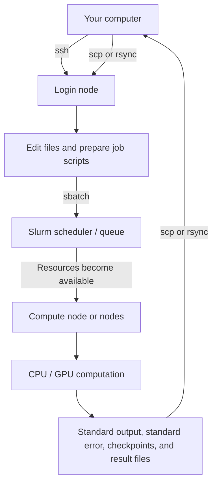

# Wits Mathematical Sciences HPC Cluster (`mscluster`)
## Comprehensive User Guide, Slurm Reference, Storage Guide, and Community Guidelines

> Consolidated from:
>
> - **Up-n-Running with HPC** — Mathematical Sciences Support (MSS), 16 March 2026
> - **A Tutorial on Using the Mathematical Sciences HPC Cluster** — Hairong Wang, 15 April 2025
> - **The Mathematical Sciences HPC Cluster: Community Guidelines** — MSS, 8 February 2024
>
> This document integrates the practical instructions, operational rules, hardware information, storage guidance, software setup, training requirements, and community expectations contained in all three sources.

---

## Important freshness and precedence note

The source documents were published at different times. Where information conflicts:

1. Prefer the **16 March 2026 workshop slides** for current high-level policy and access information.
2. Use the **15 April 2025 tutorial** for practical SSH, Slurm, and deep-learning workflow guidance.
3. Treat the **8 February 2024 community guidelines** as the detailed operational and hardware snapshot unless the current **Message of the Day (MOTD)**, `sinfo`, installed modules, or MSS instructions say otherwise.

Cluster hardware, support channels, partitions, node counts, CUDA versions, limits, and access procedures may change. Always read the MOTD after logging in and inspect the live system before requesting resources.

---

## Table of contents

1. [What `mscluster` is](#1-what-mscluster-is)
2. [Who may use it and when](#2-who-may-use-it-and-when)
3. [How HPC works](#3-how-hpc-works)
4. [The most important rules](#4-the-most-important-rules)
5. [Typical workflow](#5-typical-workflow)
6. [Logging in](#6-logging-in)
7. [Basic Linux and file transfer](#7-basic-linux-and-file-transfer)
8. [Slurm and job scheduling](#8-slurm-and-job-scheduling)
9. [Writing and submitting batch jobs](#9-writing-and-submitting-batch-jobs)
10. [Interactive jobs](#10-interactive-jobs)
11. [Monitoring, inspecting, and cancelling jobs](#11-monitoring-inspecting-and-cancelling-jobs)
12. [Partitions and hardware](#12-partitions-and-hardware)
13. [Choosing resources responsibly](#13-choosing-resources-responsibly)
14. [Storage areas](#14-storage-areas)
15. [Sideloading very large datasets](#15-sideloading-very-large-datasets)
16. [Software environments](#16-software-environments)
17. [Deep-learning workflow](#17-deep-learning-workflow)
18. [Preparing efficient and reliable code](#18-preparing-efficient-and-reliable-code)
19. [Community responsibilities and etiquette](#19-community-responsibilities-and-etiquette)
20. [Load shedding, electricity, and resilience](#20-load-shedding-electricity-and-resilience)
21. [Help, tickets, and escalation](#21-help-tickets-and-escalation)
22. [Research acknowledgements](#22-research-acknowledgements)
23. [2026 workshop requirements](#23-2026-workshop-requirements)
24. [Most common misuses](#24-most-common-misuses)
25. [Troubleshooting checklist](#25-troubleshooting-checklist)
26. [Command quick reference](#26-command-quick-reference)
27. [Known source inconsistencies and dated details](#27-known-source-inconsistencies-and-dated-details)
28. [People and organisations acknowledged by MSS](#28-people-and-organisations-acknowledged-by-mss)
29. [Source-listed online resources](#29-source-listed-online-resources)

---

# 1. What `mscluster` is

`mscluster` is the **Mathematical Sciences High-Performance Computing cluster** at the University of the Witwatersrand, Johannesburg.

It is jointly owned by:

- the School of Computer Science and Applied Mathematics;
- the School of Mathematics; and
- the School of Statistics and Actuarial Science.

It is managed and maintained by the **Mathematical Sciences Support (MSS) Team** and is housed in **TW Kambule Laboratories**.

The 2026 training material describes the cluster as having **roughly 200 nodes of varying specifications**. The detailed partition inventory in the 2024 guidelines accounts for fewer nodes, which indicates that the cluster may have expanded or changed after that hardware snapshot.

## 1.1 Purpose

Use HPC when a computation:

- cannot run on a personal computer or workstation;
- needs more CPU, GPU, memory, or storage performance than is locally available;
- would take too long on a single machine; or
- can be divided into many independent or parallel pieces.

A common `mscluster` workload is to run many variations of the same program at once, with different machines or tasks processing different parameter combinations.

## 1.2 Research domains

The cluster supports computational research relevant to the Mathematical Sciences. Recent popular areas include:

- Artificial Intelligence;
- Machine Learning;
- Reinforcement Learning; and
- Robotics.

The 2026 workshop also emphasises that Wits had a strong Reinforcement Learning research tradition before the field became broadly fashionable.

## 1.3 Relationship to the CHPC

`mscluster` complements larger national systems such as the **Centre for High Performance Computing (CHPC)**.

The intended progression is:

1. develop and test locally;
2. run smaller or medium workloads on `mscluster`;
3. migrate only workloads that exceed `mscluster` capabilities to the CHPC.

Many Honours, MSc, and PhD projects can reportedly be completed on `mscluster`, while only some require migration to the national facility.

Using `mscluster` is also intended to teach users how to become responsible “HPC citizens” before using larger, more expensive national infrastructure.

## 1.4 Wits HPC federation

The 2024 guidelines describe Wits HPC as a federated environment that evolved organically. The openly available systems listed at that time were:

| System | Typical purpose |
|---|---|
| **Wits Core Cluster** | Electrical Engineering, Medicine, Bioinformatics, CERN |
| **The CrunchYard** | Commercial code bases, commercial users, advanced user interface |
| **`mscluster`** | Teaching; Honours, MSc, and PhD research; SKA-related work |

There are also smaller, research-specific clusters that may run mature workloads continuously with effectively no spare capacity. In contrast, `mscluster` is described as “bursty”, lean, agile, and student-driven.

For Mathematical Sciences staff and students, `mscluster` is the default HPC resource and the environment for which MSS can provide the strongest support.

## 1.5 Partnerships and cost

The cluster exists through contributions from organisations and teams including:

- CHPC;
- Texas Advanced Computing Center (TACC) and other international donors;
- Wits ICT;
- PIMD;
- the Mathematical Sciences Schools; and
- Technical Laboratory Assistants (TLAs).

The service is provided to qualifying Wits users **without cost recovery**. As a historical comparison, the 2024 document states that equivalent international HPC service was valued at approximately **R18.75 per node-hour as of September 2023**.

---

# 2. Who may use it and when

## 2.1 Intended users

The resource is primarily for researchers in the participating Schools, including:

- Honours students;
- MSc students;
- PhD students;
- academic staff; and
- occasionally, collaborators of academic staff.

Some students receive temporary access for coursework or training.

The 2024 guidelines also state that staff and students from other Schools or Faculties may be accommodated, although use may need to be negotiated when demand exceeds availability.

## 2.2 Supervision requirement

Users may run code only as part of:

- a supervised research project; or
- approved coursework.

For coursework, the course lecturer is treated as the supervisor.

## 2.3 Access and onboarding

According to the 2026 workshop:

- access starts when credentials are issued;
- continued access requires completion of the onboarding form;
- if details change, submit the form again;
- MSS uses the most recent submission;
- there is an annual grace period at the start of the year; and
- non-onboarded accounts are removed after the grace period.

After onboarding:

- the login node is available **24/7**; and
- jobs use a shared queue, so requested compute resources are not guaranteed to start immediately.

---

# 3. How HPC works

The general HPC model is:

1. break a large computation into smaller pieces;
2. execute those pieces across one or more compute nodes;
3. collect the results in output files.

This can take several forms:

- many independent parameter sweeps;
- multiple processes communicating through MPI;
- multithreaded CPU code;
- GPU-accelerated code;
- distributed machine-learning training; or
- a single large-memory or large-GPU job.

The cluster does **not** automatically parallelise serial code. Software must be designed to use multiple processes, threads, nodes, or accelerator cores.

Useful concepts to study include:

- Amdahl’s Law;
- scaling efficiency;
- serial versus parallel fractions;
- communication overhead;
- load balancing; and
- the law referred to as “Lhadma’s Law” in the 2024 source, whose intended name should be confirmed because the source wording appears unclear.

---

# 4. The most important rules

> [!CAUTION]
> **Never run heavy computation directly on the login node.**

The login node is for:

- logging in;
- reading the MOTD;
- editing files;
- basic command-line operations;
- preparing scripts;
- light software/environment management;
- transferring files; and
- submitting and monitoring jobs.

Heavy CPU, memory, disk-I/O, or network-I/O activity on the login node affects every user.

Other core rules:

- Prefer `sbatch` for real work.
- Use `srun` or `salloc` only for short debugging or genuine interactive work.
- Cancel interactive allocations immediately after use.
- Request only the resources your job needs.
- Start small and scale up only after testing.
- Use high-end GPU nodes only for mature, debugged code that benefits from them.
- Read standard output and standard error files.
- Clean up unnecessary files and scratch data.
- Do not store unrelated personal data.
- Do not use the cluster for non-HPC personal computation.
- Do not flood the scheduler with excessive jobs.
- Do not monitor or investigate other users.
- Work with peers and supervisors.
- Plan early, especially before the historically busy September-November period.

---

# 5. Typical workflow



The key distinction is:

- **Login node = preparation and submission**
- **Compute nodes = computation**

A practical workflow is:

1. develop and test the code on your own computer;
2. transfer mature code and required data;
3. create or activate a software environment;
4. write a `.slurm` or shell job script;
5. submit it using `sbatch`;
6. record the returned Job ID;
7. inspect the queue with `squeue`;
8. read output and error files;
9. inspect resource usage and correctness;
10. retrieve results; and
11. clean up temporary data.

---

# 6. Logging in

## 6.1 Primary login node

The documented primary login-node IP address is:

```text
146.141.21.100
```

From Linux, macOS, WSL, modern Windows PowerShell, or another SSH client:

```bash
ssh <username>@146.141.21.100
```

Example:

```bash
ssh mmouse@146.141.21.100
```

Enter the password when prompted.

## 6.2 First connection and host key

On the first connection, SSH may display a message similar to:

```text
The authenticity of host ... cannot be established.
Are you sure you want to continue connecting (yes/no)?
```

Type:

```text
yes
```

This stores the server’s host key in the local `known_hosts` file.

Do not automatically accept a warning saying that a previously stored host key has unexpectedly changed. Confirm the change through official MSS instructions.

## 6.3 X forwarding

The 2025 tutorial gives the following optional form for forwarding graphical applications:

```bash
ssh -X <username>@146.141.21.100
```

This may not work, depending on the cluster configuration, client operating system, local X server, security settings, and application.

Advanced IDEs or graphical tools should not be run on the login node if they consume significant resources.

## 6.4 Secondary login node

The 2024 guidelines identify a second login node:

```text
146.141.21.101
```

It is intended for situations in which the primary node becomes unusable, including misuse-related overload. Additional security restrictions may apply. Do not use it as the normal login node unless there is a genuine problem with the primary node or MSS instructs you to do so.

## 6.5 Read the MOTD

Always read the **Message of the Day (MOTD)** after logging in. It may contain:

- maintenance notices;
- current partition changes;
- storage warnings;
- software updates;
- access or policy changes;
- outage information; and
- instructions that supersede older documents.

## 6.6 Logging out

End a remote shell cleanly with:

```bash
logout
```

or:

```bash
exit
```

---

# 7. Basic Linux and file transfer

## 7.1 Basic file operations

Create a directory:

```bash
mkdir <directory-name>
```

Remove a file:

```bash
rm <filename>
```

Useful additional commands include:

```bash
pwd                 # show the current directory
ls -lah             # list files
cd <directory>      # change directory
cp <source> <dest>  # copy
mv <source> <dest>  # move or rename
less <file>         # read a text file
tail -f <file>      # follow a growing output file
du -sh <path>       # estimate disk usage
```

Use removal commands carefully. Deletion may be irreversible.

## 7.2 Home-directory shorthand

The symbol:

```text
~
```

means your home directory.

On `mscluster`, the full home path is documented as:

```text
/home-mscluster/<username>/
```

## 7.3 Copying one file with `scp`

General form:

```bash
scp <source> <destination>
```

Copy a local file to the cluster:

```bash
scp localFile.txt <username>@146.141.21.100:~/myFolder/
```

Copy a cluster file back to the current local directory:

```bash
scp <username>@146.141.21.100:~/myFolder/result.txt .
```

Copy a directory recursively:

```bash
scp -r local_directory <username>@146.141.21.100:~/
```

## 7.4 Synchronising directories with `rsync`

Copy a local code directory to the cluster:

```bash
rsync -r /path/to/the_code_directory/ <username>@146.141.21.100:~/the_code_directory/
```

A more useful form for repeated synchronisation is:

```bash
rsync -avh --progress /path/to/the_code_directory/ \
  <username>@146.141.21.100:~/the_code_directory/
```

Copy results back:

```bash
rsync -avh --progress \
  <username>@146.141.21.100:~/project/results/ \
  ./results/
```

Be careful with trailing slashes because they affect whether the directory itself or only its contents are copied.

## 7.5 Windows tools

The 2024 guidelines recommend:

- **PuTTY** for SSH login and basic interaction;
- **WinSCP** for file transfer, while noting that some users had experienced problems with WinSCP.

Modern Windows also includes OpenSSH in PowerShell, so commands such as `ssh`, `scp`, and often `sftp` can be used directly.

The documented environment was primarily tested with Ubuntu Linux; Windows and macOS behaviour may vary.

---

# 8. Slurm and job scheduling

`mscluster` uses **Slurm** for cluster management and job scheduling.

## 8.1 Why a scheduler is required

The cluster is shared by many users. Slurm:

- accepts requests;
- places jobs in a queue;
- matches jobs to suitable available resources;
- starts jobs when the requested resources are available;
- aims to provide fair access; and
- aims to use the cluster efficiently.

A job may remain pending when:

- requested nodes are busy;
- the selected partition has no suitable free resources;
- the request is too large;
- a time or QoS limit applies;
- a reservation is active;
- the requested node is unavailable; or
- the job has lower scheduling priority.

## 8.2 Partitions

A Slurm partition is a group of nodes with similar characteristics. Partitions may differ by:

- CPU type;
- GPU availability and capacity;
- system memory;
- network fabric;
- maximum runtime;
- maximum node count; and
- scheduling policy.

## 8.3 Modules

The 2026 workshop introduces environment modules as a way to configure software and environment variables.

List available modules:

```bash
module avail
```

Load a module:

```bash
module load <MODULE>
```

Unload a module:

```bash
module unload <MODULE>
```

Other commonly useful commands may include:

```bash
module list
module purge
```

Use the live module list rather than assuming a package or version is installed.

## 8.4 Job IDs

`sbatch` returns a numeric Job ID:

```text
Submitted batch job 105448
```

Record it. The Job ID is used to:

- monitor the job;
- inspect scheduler information;
- cancel the job;
- associate output with a run; and
- report completed exercises where required.

## 8.5 Job states

Common `squeue` states include:

| Code | Meaning |
|---|---|
| `R` | Running |
| `PD` | Pending |

Other Slurm states may appear, but the source material explicitly explains `R` and `PD`.

---

# 9. Writing and submitting batch jobs

Batch jobs are the preferred way to run substantial workloads.

## 9.1 Script rules

A Slurm job script usually combines scheduler directives and shell commands.

Important rules:

1. Start with a valid shell shebang:
   ```bash
   #!/bin/bash
   ```
2. Put all `#SBATCH` directives before normal shell commands.
3. Slurm reads `#SBATCH` lines when the job is submitted.
4. Shell commands are executed only when the job runs.
5. A job can therefore submit successfully and still fail later because of a shell, path, environment, or program error.

## 9.2 Main directives

| Directive | Purpose |
|---|---|
| `#SBATCH --partition=<name>` | Select a partition |
| `#SBATCH --nodes=<n>` or `-N <n>` | Request nodes |
| `#SBATCH --ntasks=<n>` or `-n <n>` | Request total tasks/processes |
| `#SBATCH --ntasks-per-node=<n>` | Set tasks per node |
| `#SBATCH --cpus-per-task=<n>` | Request CPUs/threads for each task |
| `#SBATCH --mem=<amount>` | Request memory, generally per node unless another Slurm memory option is used |
| `#SBATCH --time=HH:MM:SS` | Set wall-clock limit |
| `#SBATCH --job-name=<name>` or `-J <name>` | Name the job |
| `#SBATCH --output=<path>` or `-o <path>` | Standard output file |
| `#SBATCH --error=<path>` or `-e <path>` | Standard error file |
| `#SBATCH --nodelist=<nodes>` | Request specified nodes |
| `#SBATCH -w <node>` | Request a specific node |

Use only the resources the program can actually exploit.

### Values illustrated in the 2025 tutorial

The tutorial demonstrates the following kinds of requests, although its printed example contains contradictory duplicate task settings and should not be copied as one valid script without correction:

```bash
#SBATCH --partition=bigbatch
#SBATCH --nodes=2
#SBATCH --ntasks=8
#SBATCH --ntasks-per-node=1
#SBATCH --cpus-per-task=1
#SBATCH --mem=10
#SBATCH --time=00:05:00
#SBATCH --job-name=PC-com
#SBATCH --output=/home-mscluster/<username>/slurm.%N.%j.out
#SBATCH --error=/home-mscluster/<username>/slurm.%N.%j.err
```

The source describes `--mem=10` as a 10 MB request. Slurm memory suffixes should be written explicitly in real jobs, for example `10M`, `16G`, or another justified value. The same source separately prints both `--ntasks=8` and `--ntasks=1`; only one total-task request should be selected to match the program.

## 9.3 Recommended general template

```bash
#!/bin/bash

#SBATCH --job-name=my_job
#SBATCH --partition=bigbatch
#SBATCH --nodes=1
#SBATCH --ntasks=1
#SBATCH --cpus-per-task=4
#SBATCH --mem=16G
#SBATCH --time=01:00:00
#SBATCH --output=/home-mscluster/<username>/logs/%x.%j.out
#SBATCH --error=/home-mscluster/<username>/logs/%x.%j.err

set -euo pipefail

mkdir -p /home-mscluster/<username>/logs
cd /home-mscluster/<username>/my_project

# Use either modules, Conda, or an Apptainer environment as appropriate.
# module load <MODULE>
# source ~/miniconda3/etc/profile.d/conda.sh
# conda activate myenv

python train.py
```

Useful filename substitutions include:

- `%j` — Job ID;
- `%x` — job name.

The 2025 source uses `%N` in an example output filename. In Slurm, verify the exact desired substitution on the installed version and prefer simple `%x.%j` naming when unsure.

## 9.4 Minimal batch example based on the community guidelines

```bash
#!/bin/bash

#SBATCH --job-name=test
#SBATCH --output=/home-mscluster/<username>/result.txt
#SBATCH --partition=bigbatch

sleep 60
/bin/hostname
expr 3 + 2
```

Submit:

```bash
sbatch test.sh
```

Monitor:

```bash
squeue --me
```

After completion:

```bash
cat /home-mscluster/<username>/result.txt
```

Confirm that the hostname and arithmetic result make sense.

## 9.5 MPI-style example

The tutorial includes an MPI matrix-vector multiplication example:

```bash
mpiexec -n 8 ./mpi_mat_vect_mult 64 64
```

A matching request could use:

```bash
#!/bin/bash

#SBATCH --job-name=mpi_matvec
#SBATCH --partition=bigbatch
#SBATCH --nodes=4
#SBATCH --ntasks=8
#SBATCH --ntasks-per-node=2
#SBATCH --cpus-per-task=1
#SBATCH --time=00:05:00
#SBATCH --output=/home-mscluster/<username>/logs/%x.%j.out
#SBATCH --error=/home-mscluster/<username>/logs/%x.%j.err

cd /home-mscluster/<username>/project
mpiexec -n 8 ./mpi_mat_vect_mult 64 64
```

The program must actually support distributed execution. Requesting multiple nodes does not make a serial program parallel.

## 9.6 Requesting specific nodes

One node:

```bash
#SBATCH -w mscluster61
```

A node range:

```bash
#SBATCH --nodelist=mscluster[2-4]
```

A node count without naming nodes:

```bash
#SBATCH --nodes=2
```

Specific node selection can be useful for MPI networking topology or hardware constraints, but it can also delay scheduling. Use it only when justified.

## 9.7 Submitting a job

```bash
sbatch <script-name>
```

Example:

```bash
sbatch train_job.sh
```

Batch jobs remain queued or running after you log out.

## 9.8 Standard output and error

Always configure and read:

- standard output;
- standard error;
- application logs;
- checkpoints; and
- final result files.

A job that disappears from `squeue` is not automatically successful. It may have completed or failed.

---

# 10. Interactive jobs

Interactive jobs are useful for:

- short tests;
- debugging;
- checking an environment;
- inspecting a compute node;
- commands requiring user interaction; and
- brief exploratory work.

They are less robust than batch jobs. Interactive sessions may be disrupted by:

- network disconnection;
- terminal closure;
- logout;
- load shedding; or
- user inactivity.

The 2024 guidelines advise avoiding `srun` where possible and preferring `sbatch`.

## 10.1 Interactive shell with `srun`

```bash
srun \
  --partition=stampede \
  --nodes=1 \
  --ntasks=1 \
  --ntasks-per-node=1 \
  --cpus-per-task=1 \
  --time=00:05:00 \
  --pty bash -i
```

This opens a shell on a compute node rather than on the login node.

You can then run:

```bash
python train.py
```

## 10.2 Direct interactive MPI run

The tutorial gives an example equivalent to:

```bash
srun \
  --partition=bigbatch \
  --nodes=4 \
  --ntasks=8 \
  --ntasks-per-node=2 \
  mpiexec -n 8 ./mpi_mat_vect_mult 64 64
```

If the resources are not immediately available, the command waits.

## 10.3 Allocation with `salloc`

Request an allocation:

```bash
salloc \
  --nodes=1 \
  --partition=bigbatch \
  --ntasks-per-node=1 \
  --time=00:30:00
```

A successful allocation may display:

```text
salloc: Granted job allocation 105453
```

Run a command in the allocation:

```bash
srun hostname
```

Then run the workload:

```bash
srun python train.py
```

## 10.4 Cancel the allocation

When finished:

```bash
scancel "$SLURM_JOB_ID"
```

Do not leave unused interactive jobs holding nodes.

---

# 11. Monitoring, inspecting, and cancelling jobs

## 11.1 Queue commands

All jobs belonging to the current user:

```bash
squeue --me
```

or:

```bash
squeue -u <username>
```

Only running jobs:

```bash
squeue -u <username> -t RUNNING
```

Only pending jobs:

```bash
squeue -u <username> -t PENDING
```

Jobs in `bigbatch`:

```bash
squeue -u <username> -p bigbatch
```

General queue:

```bash
squeue
```

## 11.2 Partition and node information

```bash
sinfo
```

This can show:

- partition names;
- availability;
- node states;
- time limits; and
- resource status.

## 11.3 Detailed job information

```bash
scontrol show job <JOBID>
```

Example:

```bash
scontrol show job 12345
```

Use a real Job ID.

## 11.4 Cancel one job

```bash
scancel <JOBID>
```

## 11.5 Cancel all of your jobs

```bash
scancel -u <username>
```

or:

```bash
scancel --user=<username>
```

## 11.6 Cancel all pending jobs

```bash
scancel -t PENDING -u <username>
```

## 11.7 Direct system-information examples

The 2024 guide provides these examples:

```bash
srun -N6 -p bigbatch -l /bin/hostname
```

```bash
srun -N2 -p biggpu -l cat /proc/cpuinfo | grep model
```

```bash
srun -N4 -p stampede -l /usr/bin/uptime
```

These are teaching examples. Prefer a batch job for normal work.

---

# 12. Partitions and hardware

> [!WARNING]
> The following detailed specifications are a **February 2024 snapshot**. The 2026 slides state that the cluster has roughly 200 nodes, so the live configuration may differ. Confirm with `sinfo`, the MOTD, modules, and MSS instructions.

## 12.1 Partition summary

| Partition | Intended use | 2024 hardware snapshot | Limits in the 2024 guide |
|---|---|---|---|
| `stampede` | General-purpose work; jobs that can use InfiniBand | 40 nodes; each node: 2 × Xeon E5-2680 CPUs, 2 × GTX 1060 GPUs with 6 GB each, 32 GB system RAM | `MaxTime=4320`, `MaxNodes=20` |
| `bigbatch` | Larger jobs needing a bigger GPU and more RAM | 48 nodes; each node: Intel Core i9-10940X with 14 cores, RTX 3090 with 24 GB, 128 GB system RAM | `MaxTime=4320`, `MaxNodes=48` |
| `biggpu` | Mature jobs that genuinely require very large GPU and system memory | 4 nodes; each node: 2 × Xeon Platinum 8280L, 28 cores per CPU / 56 cores total, 2 × Quadro RTX 8000 with 48 GB each / 96 GB total, 1 TB system RAM | `MaxTime=4320`, `MaxNodes=4` |

The numerical unit of `MaxTime=4320` is not explicitly explained in the source table; verify the displayed Slurm time limit with `sinfo`.

The 2024 guide also states that memory was not explicitly capped by a separate partition policy in that snapshot, but every request remained physically limited by the RAM installed in the selected node.

## 12.2 `stampede`

Use for:

- general-purpose jobs;
- early tests;
- workloads that can use its CPUs or GTX 1060 GPUs; and
- MPI workloads that benefit from InfiniBand.

Topology noted in 2024:

- `mscluster[2-21]` are connected through one InfiniBand switch;
- `mscluster[22-42]` are connected through another.

MPI node selection can matter because communication across switches may be less desirable than communication within one switch group.

## 12.3 `bigbatch`

Use when:

- `stampede` does not meet the workload’s requirements;
- an RTX 3090-class GPU is useful;
- more system memory is needed; or
- a larger number of suitable nodes is required.

The 2024 document states that 10 Gb networking had potential but had not yet been implemented.

## 12.4 `biggpu`

Use only when:

- the code is mature and debugged;
- very large GPU memory is needed;
- the workload can effectively use multiple large GPUs;
- up to 1 TB of system RAM per node is justified; or
- `stampede` and `bigbatch` are insufficient.

These nodes are expensive to run and maintain and are in high demand.

The 2024 narrative says “those three nodes”, while the hardware table says **4 nodes**. Treat the table as the more explicit snapshot, but verify the current partition.

## 12.5 Quality of Service

MSS may apply Quality of Service controls during the year, including:

- reservations;
- job-time extensions;
- personal quotas;
- group quotas;
- maximum running jobs;
- maximum submitted jobs;
- per-user limits;
- per-partition limits; or
- per-research-group limits.

The preference expressed in the 2024 guide is to avoid excessive QoS enforcement and rely on responsible communal use, but MSS will intervene when necessary.

---

# 13. Choosing resources responsibly

Choosing a suitable partition and request can help a job start sooner.

Consider:

- whether the program is CPU- or GPU-based;
- required GPU model and GPU memory;
- system RAM;
- expected runtime;
- CPU threads;
- number of tasks;
- number of nodes;
- inter-node communication;
- disk-I/O intensity; and
- whether the program can actually scale.

Recommended progression:

1. test locally;
2. submit a small, short job;
3. begin on `stampede` when appropriate;
4. move to `bigbatch` only when justified;
5. use `biggpu` only when the previous options are inadequate.

Common mistakes:

- requesting far more memory than needed;
- requesting many nodes for serial code;
- requesting a GPU for code that does not use it;
- using large GPUs for early debugging;
- submitting long jobs to short partitions;
- choosing specific nodes unnecessarily;
- leaving an interactive allocation idle; and
- scaling before validating correctness.

---

# 14. Storage areas

The cluster provides multiple storage locations for different purposes.

## 14.1 Storage summary

| Location | Purpose | Retention / limits described in 2024 |
|---|---|---|
| `/home-mscluster/<username>/` | Home directory, code, development environment, normal working files | Up to approximately 50 GB of data |
| `/scratch/<username>/` | Fast local scratch on each compute node for high disk-I/O jobs | Temporary; a few weeks; may be cleared with little warning |
| `/gluster/<username>/` | Fast network scratch through GlusterFS | Temporary; a few months; may be cleared with little warning |
| `/datasets/<username>/` | Large datasets, typically 50 GB to a few TB | Intended for large dataset storage |

The 2025 tutorial highlights three dataset-related locations:

1. the home directory;
2. `/datasets/<username>/`; and
3. `/gluster/<username>/`.

It recommends using `/datasets` or `/gluster` for large datasets rather than the home directory.

## 14.2 Home directory

Example:

```text
/home-mscluster/mmouse/
```

This is where the user lands after logging in.

Use it for:

- source code;
- scripts;
- lightweight working data;
- personal software environments; and
- job logs and results within quota.

Datasets larger than approximately 50 GB should be moved to `/datasets/<username>/`.

## 14.3 Local scratch

Each compute node may provide:

```text
/scratch/<username>/
```

Use it when heavy disk I/O would otherwise flood the network filesystem.

Important properties:

- each node has its own local directory;
- data is not automatically shared across nodes;
- it is not long-term storage;
- it may be removed with little warning;
- users must clear files after jobs finish.

The 2024 guide mentions `cssh` as a possible tool for staging or deleting files across node-local scratch directories, but warns not to use it to launch computation directly because doing so may affect other users.

## 14.4 Network scratch

Example:

```text
/gluster/<username>/
```

This is a shared GlusterFS scratch area that avoids manually managing a different scratch folder on each node.

Use it for temporary, network-visible data. It is not permanent storage and may be cleared if it affects the cluster.

## 14.5 Large datasets

Example:

```text
/datasets/<username>/
```

Use this for datasets from approximately 50 GB to several terabytes.

Do not use a data-management login or dataset server as a place to perform computation. Preprocessing must normally be submitted as a Slurm job unless it uses only trivial CPU, RAM, disk, and network resources.

## 14.6 Data-management best practices

- Keep code and configuration separate from large data.
- Do not duplicate large datasets unnecessarily.
- Stage high-I/O data to suitable scratch storage.
- Copy final outputs back to durable storage.
- Remove temporary files.
- Never assume scratch storage is backed up.
- Do not use the cluster as general-purpose personal cloud storage.
- Where possible, wrangle very large data locally within TW Kambule Laboratories to reduce network impact.

---

# 15. Sideloading very large datasets

For unusual multi-terabyte transfers, MSS may support:

- dedicated network interfaces;
- dedicated disks;
- copying data onto the cluster without saturating normal user networks;
- copying data off the cluster; and
- in rare cases, transfer using USB external drives.

Arrange this through MSS before proceeding.

While connected to a sideloading endpoint, perform only the data-transfer work required. Do not preprocess data there unless the activity is trivial.

## 15.1 Sideload to `/datasets`

The 2024 example uses:

```bash
ssh <username>@10.100.14.250
cd /datasets/<username>
wget http://<URL-TO-YOUR-DATA>
```

## 15.2 Sideload to `/gluster`

```bash
ssh <username>@10.100.14.2
cd /gluster/<username>
wget http://<URL-TO-YOUR-DATA>
```

## 15.3 Sideload to the home directory

The guidance is: **ideally, do not do this**.

For a rare approved use case:

```bash
ssh <username>@10.100.14.252
cd /home-mscluster/<username>
wget http://<URL-TO-YOUR-DATA>
```

Discuss the use case with MSS first.

These `10.x.x.x` addresses are private network addresses and may only be reachable from approved networks or locations.

---

# 16. Software environments

A selection of computational software is installed, but users are encouraged to manage personal software in their home directories where practical.

The available mechanisms include:

- environment modules;
- Conda;
- `pip`;
- Apptainer containers;
- locally compiled software; and
- packages in `/usr/local/`.

## 16.1 Installing Miniconda

The 2025 tutorial gives:

```bash
wget https://repo.anaconda.com/miniconda/Miniconda3-latest-Linux-x86_64.sh
bash Miniconda3-latest-Linux-x86_64.sh
```

Follow the installer prompts.

If Conda is not available in the current shell after installation:

```bash
source ~/.bashrc
```

A safer workflow is to inspect the installer and confirm the destination before running it.

## 16.2 Creating an environment

```bash
conda create --name myenv python=3.10
conda activate myenv
```

Use separate environments for projects with incompatible dependencies.

## 16.3 Personal Anaconda installation

The 2024 guidelines strongly recommend installing and managing Anaconda or Miniconda in the user’s home directory because Python environments vary substantially between users and projects.

## 16.4 Machine-learning libraries

TensorFlow, PyTorch, and related packages are best managed in a personal environment.

A dated example from the 2025 tutorial for PyTorch with CUDA 12.1 is:

```bash
conda install pytorch torchvision torchaudio pytorch-cuda=12.1 \
  -c pytorch -c nvidia
```

This command is only an example. The correct installation depends on:

- the current GPU driver;
- installed CUDA compatibility;
- the selected framework release;
- Python version;
- Conda channels; and
- current cluster policy.

## 16.5 CUDA

The 2024 guide recommends CUDA 12.0 and states that multiple CUDA versions are installed under `/usr/local/`.

Example environment configuration:

```bash
export PATH=/usr/local/cuda-12.0/bin:$PATH
export LD_LIBRARY_PATH=/usr/local/cuda-12.0/lib64:$LD_LIBRARY_PATH
export CUDA_HOME=/usr/local/cuda-12.0
```

Before using this:

```bash
ls -lah /usr/local/
module avail
nvidia-smi
```

Use the version compatible with the driver and framework. Do not assume the 2024 recommendation is still current.

## 16.6 Apptainer

Apptainer, previously called Singularity, is available.

It is recommended for:

- reproducible workflows;
- difficult software stacks;
- research-group standard environments;
- sharing a tested configuration; and
- reducing repeated installation work.

Research groups should collaborate with supervisors to build, maintain, and promote common containers.

## 16.7 R

A system R installation may be available. The 2024 guide recommends compiling R and installing required R packages in the user’s home directory where appropriate.

## 16.8 MATLAB, Mathematica, and other software

Less frequently used software may be installed under:

```text
/usr/local/
```

Inspect:

```bash
ls -lah /usr/local/
```

Add approved software paths to `~/.bashrc` when useful.

Software requests should go through the current MSS support process.

---

# 17. Deep-learning workflow

## 17.1 Recommended process

1. Develop and test the model locally.
2. Transfer mature code to the cluster.
3. Place data in the appropriate storage area.
4. Create a dedicated environment.
5. Confirm GPU and CUDA compatibility.
6. Write a batch job.
7. Start with a small subset of data and a short time limit.
8. Inspect output, error, metrics, checkpoints, and resource use.
9. Scale only after the run is correct.
10. Clean temporary files and preserve final artifacts.

## 17.2 Example training job

```bash
#!/bin/bash

#SBATCH --job-name=dl_train
#SBATCH --partition=bigbatch
#SBATCH --nodes=1
#SBATCH --ntasks=1
#SBATCH --cpus-per-task=8
#SBATCH --mem=64G
#SBATCH --time=04:00:00
#SBATCH --output=/home-mscluster/<username>/logs/%x.%j.out
#SBATCH --error=/home-mscluster/<username>/logs/%x.%j.err

set -euo pipefail

source ~/miniconda3/etc/profile.d/conda.sh
conda activate myenv

cd /home-mscluster/<username>/project
python train.py
```

The 2025 tutorial refers to an example `train_job.sh` in an `examples/src_1` folder and asks learners to write an equivalent job script for a Python program in `src_2`.

## 17.3 Experiment tracking

The tutorial recommends tools such as:

- Git for source control; and
- Weights & Biases for experiment tracking.

Experiment tracking is useful for:

- hyperparameters;
- metrics;
- run comparisons;
- model artifacts;
- system metrics; and
- reproducibility.

Do not expose credentials or private data in code or logs.

---

# 18. Preparing efficient and reliable code

## 18.1 Develop locally first

As far as possible:

- write code locally;
- test correctness locally;
- use small fixtures;
- add automated tests;
- profile obvious bottlenecks; and
- transfer only mature code to the cluster.

Do not treat the login node as the main development machine.

## 18.2 Start with a minimal successful workflow

Before a large experiment:

1. submit a tiny job;
2. verify the environment;
3. verify file paths;
4. verify data access;
5. verify output and error paths;
6. verify checkpoints;
7. verify that the program exits cleanly.

## 18.3 Parallel code must be written as parallel code

Use appropriate tools such as:

- MPI;
- multiprocessing;
- multithreading;
- distributed training frameworks;
- TensorFlow;
- PyTorch distributed tools; or
- GPU kernels.

The cluster cannot magically transform serial code into parallel code.

## 18.4 Progress reporting

Programs should periodically write progress information.

The 2024 guide gives the example that a small progress report every **six hours** can help catch a problem early and save hundreds of compute hours.

Useful progress data includes:

- epoch or iteration;
- elapsed time;
- estimated completion;
- loss or objective value;
- validation metrics;
- processed samples;
- checkpoint location; and
- warnings.

Avoid excessive logging that creates heavy disk I/O.

## 18.5 Monitor resource use

Check whether requested resources are actually used:

- CPU utilisation;
- RAM;
- GPU utilisation;
- GPU memory;
- disk I/O; and
- network I/O.

High utilisation alone does not prove that the model or algorithm is converging toward a meaningful result. Discuss correctness and convergence checks with the supervisor.

## 18.6 Clean termination and ghost processes

Code should:

- exit cleanly;
- close workers;
- terminate child processes;
- flush outputs;
- release files;
- stop data loaders;
- handle signals where appropriate; and
- avoid leaving “ghost” processes on compute nodes.

Prepare a cleanup procedure when the application can leave children behind.

## 18.7 Plan for busy periods

The 2024 guide reports historically minimal spare capacity from **September through November**.

Start projects early. Do not leave essential runs until the final deadline and then expect priority or special privileges.

---

# 19. Community responsibilities and etiquette

`mscluster` is a shared academic research instrument, not a commercial cloud service.

## 19.1 Supervisor responsibilities

Supervisors are asked to:

- confirm that a proposed problem genuinely requires HPC;
- monitor computational results routinely;
- verify that runs are moving toward a solution or better understanding;
- understand the cluster’s capabilities and constraints;
- consider becoming a CHPC Principal Investigator;
- keep reserve CHPC credits for work `mscluster` cannot handle;
- review monthly usage statistics for the research group; and
- act as the first escalation point beyond MSS.

## 19.2 Research-student responsibilities

Research students should:

- learn how the cluster works;
- understand bottlenecks and points of failure;
- moderate expectations;
- use the system creatively but responsibly;
- work with peers;
- communicate through the correct support process;
- monitor their jobs;
- remove unused files;
- avoid disrupting other users; and
- follow the escalation path.

CHPC training courses are suggested as a way to improve HPC knowledge.

## 19.3 Do not hog the login node

Do not perform work on `146.141.21.100` that heavily uses:

- CPU;
- memory;
- disk I/O; or
- network I/O.

If a computation should be running through `sbatch`, `srun`, or an allocation, do not execute it directly on the login node.

## 19.4 Do not flood the cluster

Avoid:

- excessive simultaneous submissions;
- unnecessary parameter sweeps;
- duplicate runs;
- repeated failing jobs;
- over-requesting high-end nodes;
- creating avoidable scheduler pressure.

MSS prefers community consideration over rigid policing, but may apply QoS restrictions.

## 19.5 Personal storage and computation are prohibited

Do not use the cluster for:

- unrelated personal files;
- general-purpose backups;
- non-research media storage;
- personal applications;
- cryptocurrency mining;
- unrelated services; or
- non-HPC personal computation.

Only data required for the computational part of approved research or coursework should be stored.

## 19.6 Work with peers

Peer collaboration helps build a community of practice.

Examples include:

- sharing Slurm templates;
- reviewing resource requests;
- maintaining Apptainer images;
- documenting domain-specific workflows;
- troubleshooting reproducibility; and
- teaching new users.

## 19.7 Respect privacy and boundaries

Do not monitor other users, inspect their work, or attempt to infer their workloads beyond normal scheduler information needed for your own planning.

---

# 20. Load shedding, electricity, and resilience

The 2024 guidelines describe load shedding as a serious operational constraint.

The cluster has UPS and generator protection, but these systems have physical limits.

Reported operational experience in that document:

- one load-shedding event per day may be survivable;
- around three events per day makes problems likely and forces staff to work outside office hours;
- more than three events per day can lead to physical equipment failure.

Effects may include:

- login unavailability;
- delayed jobs;
- reduced performance;
- interrupted interactive sessions;
- node failures;
- reboots;
- lengthy recovery; and
- repairs lasting days.

Users should:

- monitor actual and scheduled Braamfontein load shedding;
- prefer restartable batch jobs;
- write checkpoints;
- avoid relying on fragile interactive sessions;
- preserve intermediate results;
- design idempotent or resumable workflows; and
- expect availability to be affected during power instability.

The 2024 document mentions the ESP app as a way to monitor load shedding.

---

# 21. Help, tickets, and escalation

## 21.1 Current-status caution

The March 2026 workshop says that MSS was working on a help desk and would announce it once operational.

The February 2024 guidelines describe an earlier virtual help-desk process and email address.

Because the newer and older sources conflict, use the **MOTD, onboarding communication, course communication, or current MSS announcement** as the authoritative support route.

## 21.2 Legacy 2024 ticket process

The 2024 guide says:

- do not email staff members directly;
- open one ticket per issue;
- use a student or staff email;
- include the subject line `TWK HPC Query`;
- use tickets for usage queries, software changes, training requests, and system problems.

The legacy address listed is:

```text
support@wits-mss.supportsystem.com
```

Treat this as historical until confirmed through a current MSS source.

## 21.3 Escalation path

The 2024 escalation route is:

1. arrange a meeting with MSS through the help-desk process;
2. if unresolved, ask the supervisor to discuss it with MSS;
3. if unresolved, the supervisor may raise it with the Head of School;
4. if unresolved, the Head of School may raise it with the appropriate Dean or Assistant Dean in the Faculty of Science.

This process helps distinguish:

- transient failures;
- solvable problems;
- constraints that require a workaround; and
- problems that cannot be solved within available resources.

## 21.4 Other learning and support resources

The documents mention:

- the `mscluster` Wiki;
- undergraduate HPC Interest Groups;
- competitive HPC training;
- CHPC courses;
- Software Carpentry shell training;
- a one-day Software Carpentry-style HPC workshop for a group of roughly 10-15 people;
- Wits HPC Interest Group materials; and
- collaboration with peers.

The 2025 tutorial specifically lists:

- WitsHPC/HPC-InterestGroup Linux and cluster talks on GitHub;
- the 2024 community guidelines; and
- a Weights & Biases PyTorch integration tutorial.

---

# 22. Research acknowledgements

MSS asks users to acknowledge Mathematical Sciences HPC infrastructure in any:

- thesis;
- paper;
- research report;
- project;
- publication; or
- presentation

that refers to results computed on the infrastructure.

Suggested acknowledgement:

> “Computations were performed using High Performance Computing infrastructure provided by the Mathematical Sciences Support unit at the University of the Witwatersrand, Johannesburg.”

This supports donor reporting and future fundraising.

---

# 23. 2026 workshop requirements

The March 2026 workshop slide deck lists the following participant tasks:

- communicate and collaborate with peers;
- work through the supplied exercises;
- begin with the `readme.txt` files;
- understand the `.slurm` files in every example;
- run the jobs;
- check whether the results match expectations;
- answer the question set on Moodle;
- record Job IDs on Moodle.

The stated deadline was:

```text
26 March 2026
```

This deadline is workshop-specific and historical unless reused by a current course.

---

# 24. Most common misuses

The 2026 workshop identifies these common problems:

1. Running code directly on the login node.
2. Starting interactive jobs and then not using them.
3. Running advanced IDEs on the login node.
4. Using high-end nodes for code that does not require them.
5. Not reading standard output and standard error files.
6. Getting permission to use a server for `/datasets`, then performing work unrelated to data management.
7. Leaving work too late and expecting special privileges.
8. Not taking time to learn how the cluster works.
9. Monitoring other users.

The broader documents add:

- leaving ghost processes;
- flooding the cluster;
- failing to clean scratch data;
- storing personal or irrelevant files;
- submitting serial programs to many nodes;
- using large GPUs for immature code;
- ignoring load shedding; and
- escalating issues outside the documented route.

---

# 25. Troubleshooting checklist

## 25.1 SSH login fails

Check:

- username spelling;
- no accidental spaces before or after the password;
- Caps Lock and keyboard layout;
- VPN/network restrictions;
- whether the primary login node responds;
- MOTD or official outage notices;
- whether credentials are temporary or expired;
- whether onboarding is complete;
- whether the account has been removed after the annual grace period.

Do not paste passwords into chat, scripts, or command history.

## 25.2 Job remains pending

Run:

```bash
squeue --me
scontrol show job <JOBID>
sinfo
```

Consider:

- smaller memory;
- fewer nodes;
- fewer CPUs;
- a shorter time limit;
- another suitable partition;
- removing unnecessary node constraints;
- testing on a smaller partition first.

## 25.3 Job vanished from `squeue`

Check:

- standard output;
- standard error;
- application logs;
- result files;
- whether the job reached its time limit;
- whether a path or environment failed.

A missing queue entry does not prove success.

## 25.4 Program works locally but fails on the cluster

Check:

- current directory;
- absolute paths;
- case-sensitive filenames;
- environment activation;
- module versions;
- Python version;
- CUDA compatibility;
- file permissions;
- line endings;
- executable permissions;
- dataset location;
- output directory existence.

Useful commands:

```bash
pwd
which python
python --version
conda env list
module list
nvidia-smi
ls -lah
```

## 25.5 GPU is allocated but unused

Check:

- framework sees the GPU;
- model and tensors are moved to the device;
- correct CUDA build is installed;
- the GPU driver is compatible;
- workload is large enough;
- data loading is not the bottleneck.

## 25.6 Disk-I/O bottleneck

Consider:

- staging data to `/scratch/<username>/`;
- using `/gluster/<username>/` where shared scratch is appropriate;
- reducing tiny-file access;
- batching reads;
- caching preprocessed data;
- cleaning temporary files.

## 25.7 Interactive session ended unexpectedly

Interactive jobs are vulnerable to disconnections and load shedding.

Move the command into an `sbatch` script, add checkpoints, and make the run resumable.

---

# 26. Command quick reference

## Connection and transfer

```bash
ssh <username>@146.141.21.100
ssh -X <username>@146.141.21.100
scp <source> <destination>
rsync -avh --progress <source> <destination>
logout
```

## Modules

```bash
module avail
module load <MODULE>
module unload <MODULE>
module list
module purge
```

## Slurm submission and status

```bash
sbatch job.slurm
squeue
squeue --me
squeue -u <username>
squeue -u <username> -t RUNNING
squeue -u <username> -t PENDING
squeue -u <username> -p bigbatch
sinfo
scontrol show job <JOBID>
```

## Cancellation

```bash
scancel <JOBID>
scancel -u <username>
scancel -t PENDING -u <username>
scancel "$SLURM_JOB_ID"
```

## Interactive use

```bash
srun --partition=stampede --nodes=1 --ntasks=1 \
  --cpus-per-task=1 --time=00:05:00 --pty bash -i
```

```bash
salloc --nodes=1 --partition=bigbatch \
  --ntasks-per-node=1 --time=00:30:00
```

## Conda

```bash
conda create --name myenv python=3.10
conda activate myenv
conda deactivate
```

## Storage paths

```text
/home-mscluster/<username>/
/scratch/<username>/
/gluster/<username>/
/datasets/<username>/
```

---

# 27. Known source inconsistencies and dated details

This section preserves important discrepancies rather than silently discarding them.

## 27.1 Cluster size

- 2026: roughly **200 nodes**.
- 2024 partition table: 40 `stampede` + 48 `bigbatch` + 4 `biggpu` = 92 listed nodes.

The cluster likely changed between documents, or the 2024 table did not represent every current partition.

## 27.2 Help desk

- 2026: help desk described as being developed and awaiting announcement.
- 2024: a specific virtual help desk and email address are given.

Use current MSS communication.

## 27.3 CUDA

- 2024: recommends CUDA 12.0.
- 2025: gives a PyTorch CUDA 12.1 installation example.

These are dated examples, not universal requirements.

## 27.4 `biggpu` node count

- Detailed 2024 partition section: **4 nodes**.
- Earlier 2024 community narrative: refers to “those three nodes”.

Verify the live system.

## 27.5 Batch Job ID typo in the 2025 tutorial

The example terminal output says:

```text
Submitted batch job 105448
```

but the surrounding prose refers to `105447`. The displayed submission output and following `squeue` example use `105448`.

## 27.6 Slurm syntax formatting in the 2025 PDF

The PDF’s typeset code visually separates `#` and `SBATCH` and includes an apparent `SMATCH` typo. Valid directives must begin exactly with:

```bash
#SBATCH
```

## 27.7 Arithmetic command in the 2024 batch example

The source typesets an `echo`/`expr` line with unusual quotation marks. A valid command is:

```bash
expr 3 + 2
```

or:

```bash
echo $((3 + 2))
```

## 27.8 “Lhadma’s Law”

The 2024 source recommends reading Amdahl’s Law and “Lhadma’s Law”. The second name appears unclear or misspelled in the source and should be confirmed before citation.

## 27.9 Time limits

The 2024 partition table gives `MaxTime=4320` without clearly stating the unit in the prose. Inspect current values with:

```bash
sinfo
```

## 27.10 Hardware and networking

The 2024 statements about:

- GPU models;
- RAM;
- node counts;
- InfiniBand topology;
- unimplemented 10 Gb networking; and
- partition limits

are historical snapshots and may no longer describe the live cluster.

---

# 28. People and organisations acknowledged by MSS

The 2024 community guidelines thank:

- **Prof. Ebrahim Momoniat** — leadership in scaling MSS operations, including `mscluster`;
- **Prof. Scott Hazelhurst** — early strong advocacy for HPC at Wits;
- **Prof. Turgay Celik** — stewardship of the Ranger donation from TACC;
- **Mr. Bryan Johnson** — development of the local HPC community through the CHPC Ecosystems Project;
- **CHPC and TACC** — continuing support and encouragement;
- **PIMD** — work to provide power despite load shedding;
- **Wits ICT Networking** — maintaining network service under difficult conditions;
- **TLAs and MSS staff** — operation and support of the cluster; and
- **the researchers using the system** — whose work provides the reason for maintaining the infrastructure.

---

# 29. Source-listed online resources

The source documents point users to the following external material:

## Slurm

- Slurm quick start:
  <https://slurm.schedmd.com/quickstart.html>

## Unix shell training

- Software Carpentry shell novice lesson:
  <https://swcarpentry.github.io/shell-novice/>

## Conda and Python environments

- Anaconda archive:
  <https://repo.anaconda.com/archive/>
- Miniconda installers:
  <https://repo.anaconda.com/miniconda/>
- PyTorch installation selector:
  <https://pytorch.org/get-started/locally/#linux-anaconda>

## Wits HPC training

- Wits HPC Interest Group Linux/cluster talks:
  <https://github.com/WitsHPC/HPC-InterestGroup/tree/main/talks/linux/clusters>

## Experiment tracking

- Weights & Biases simple PyTorch integration tutorial:
  <https://colab.research.google.com/github/wandb/examples/blob/master/colabs/pytorch/Simple_PyTorch_Integration.ipynb#scrollTo=qmRJWz4nvi8m>

## Archived community-guidelines link printed in the 2025 tutorial

- The tutorial links to a Dropbox copy of the February 2024 guidelines. The uploaded `mscluster-08-02-2024-5.pdf` used to build this consolidated guide contains that document, so the local copy should be preferred for this guide.

---

## Final operational checklist

Before submitting a substantial job, confirm all of the following:

- [ ] I read the current MOTD.
- [ ] My account and onboarding are valid.
- [ ] I tested the code locally.
- [ ] The code exits cleanly.
- [ ] I selected an appropriate partition.
- [ ] I requested only the CPUs, GPUs, nodes, memory, and time I need.
- [ ] My program can use the requested parallel resources.
- [ ] My dataset is in the correct storage area.
- [ ] My output and error directories exist.
- [ ] My environment or container is reproducible.
- [ ] The job writes useful progress information.
- [ ] Long runs have checkpoints and can resume.
- [ ] I will inspect both standard output and standard error.
- [ ] I will clean temporary and scratch files.
- [ ] I will acknowledge MSS infrastructure in research outputs.
